# Manual de uso · Administrador General

Panel de administración Altus · equipo de escritorio · versión del 20 de septiembre de 2026

Este manual describe lo que ve y lo que hace quien administra la clínica con el perfil
**Administrador General**. Está escrito para quien va a usar el sistema, no para quien lo programa.

A diferencia de los otros siete perfiles, Administración **no trabaja en el punto de venta**: trabaja
en el panel, que se abre en un navegador de escritorio. Por eso las pantallas de este manual son
anchas y con tablas, no tabletas apaisadas.

Las capturas se tomaron con la cuenta de pruebas «Admin Pruebas» y pacientes de ejemplo. En la
clínica aparecerán los nombres reales.

---

## 1. Qué hace Administración

Administración **configura y vigila**. Es el único perfil que entra al panel: da de alta al personal
y le asigna su rol, captura los datos profesionales de los médicos y los de la clínica, define cómo
se paga a cada persona, revisa los cortes de caja y el inventario completo, saca reportes y lee la
bitácora. También es el único que puede bloquear una cuenta.

| Puede | No puede |
|---|---|
| Dar de alta personal, editarlo, **cambiarle la contraseña**, bloquearlo y deshabilitarlo | Recuperar una contraseña olvidada: sólo puede poner una nueva |
| Asignar el **rol** de cada persona, que decide a qué pantallas entra | Dar a alguien más de un rol a la vez |
| Capturar los **datos para la receta** de cada médico (cédula, universidad, logo) y los **datos de la clínica** | Cambiar una receta ya emitida |
| Definir el **esquema de pago** de cada persona, ver la **nómina** y registrar pagos | Pagar dos veces el mismo periodo a la misma persona |
| Sacar cualquier **reporte** para Excel o impreso | — |
| Ver todos los **cortes de caja**, su detalle y reimprimirlos; **cerrar la caja que alguien dejó abierta**, con motivo | Abrir un turno de caja: eso es de Caja |
| **Corregir un lote** (número, caducidad, estante), hacer un **conteo** y **dar de baja**, con motivo | Cambiar la cantidad de un lote a mano: sólo con conteo o baja |
| **Cancelar o ajustar** una receta pendiente, con motivo | Cambiar una receta ya surtida o aplicada |
| **Pedir, cancelar y recibir requisiciones** por Enfermería | — |
| **Cerrar o corregir las horas** de un turno, y **anular un pago** registrado por error, con motivo | Borrar un pago: se anula, y queda con su motivo |
| Ver cada **almacén** con sus productos, lotes y valor, e **imprimir el inventario** | — |
| Dar de **alta productos con su costo** y su primer lote, y corregir costo y precio | — |
| **Surtir** órdenes médicas y requisiciones desde el panel | — |
| Administrar **convenios de empresa** y ver los pacientes de cada una | — |
| Leer la **bitácora** completa | Borrar o editar un asiento de la bitácora |

Todo lo que hace Administración queda en la bitácora con su nombre, igual que el de cualquier otro
perfil. Nadie está por encima del registro.

---

## 2. Entrar al panel

El panel vive en la dirección de la clínica seguida de `/app`. Escribe tu **usuario** (`admin`, o el
que te dieron, sin arroba) y tu contraseña, y pulsa **Entrar**.

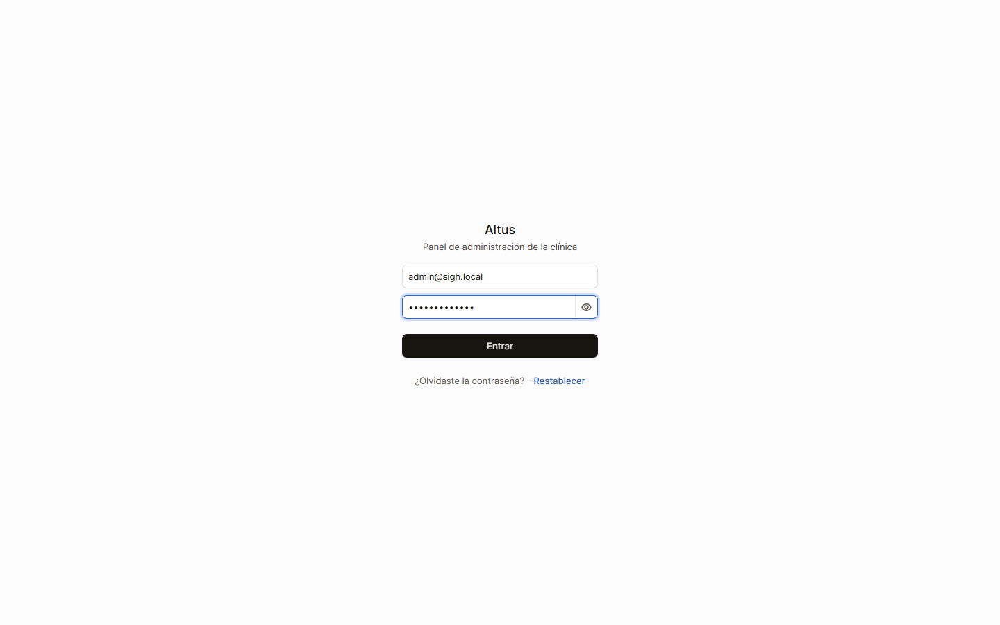

Aterrizas en **Pedidos**, la lista de ventas que trae Medusa. A la izquierda, el menú: arriba las
pantallas que vienen de fábrica (Pedidos, Productos, Inventario, Pacientes, Promociones) y, bajo
**Extensiones**, las de Altus.

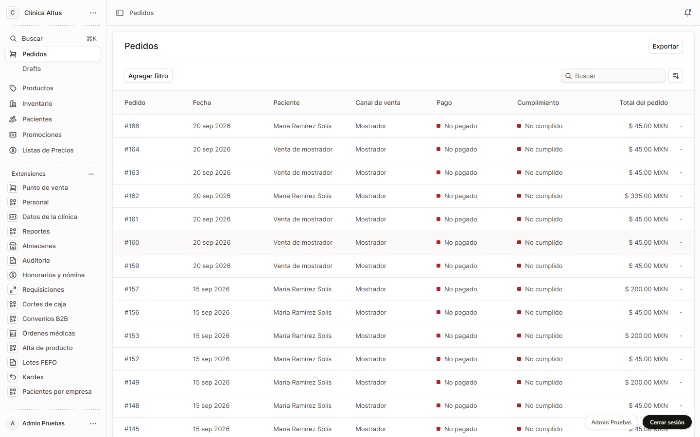

> **Lo que dicen las columnas «Pago» y «Cumplimiento».** En esa lista casi todo aparece como **No
> pagado** y **No cumplido**, incluso lo que Caja ya cobró. Son estados internos de Medusa que el
> punto de venta no usa. **Lo que vale es el corte de caja.**

---

## 3. Personal y roles

### 3.1 Quién entra y con qué perfil

**Personal** lista cada cuenta con su usuario, su nombre, su número de empleado y su **rol**, y a la
derecha las acciones: **Editar**, **Contraseña**, **Bloquear** y **Deshabilitar**.

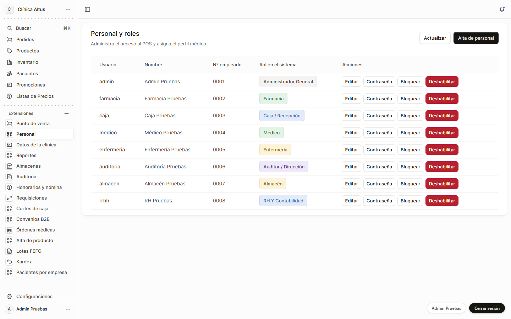

### 3.2 Dar de alta

**Alta de personal** abre el formulario:

- **Usuario** — sin arroba, en minúsculas, de tres letras o más. Es lo único que la persona escribe al entrar.
- **Contraseña** — el sistema rechaza las débiles.
- **Nombre** y **Apellido** — salen en la bitácora, en el corte y en la nómina.
- **Número de empleado** — el de nómina o credencial. Único: no se reutiliza el de alguien que se fue.
- **Correo de aviso** — opcional, y **no** es con lo que entra: es a dónde le llegan los avisos.

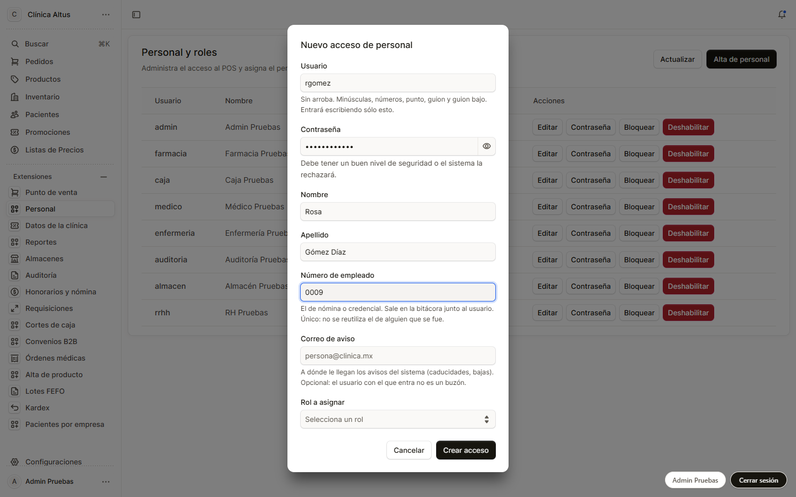

### 3.3 El rol es la decisión importante

**Rol a asignar** decide a qué pantallas entra la persona y qué puede hacer. Es obligatorio.

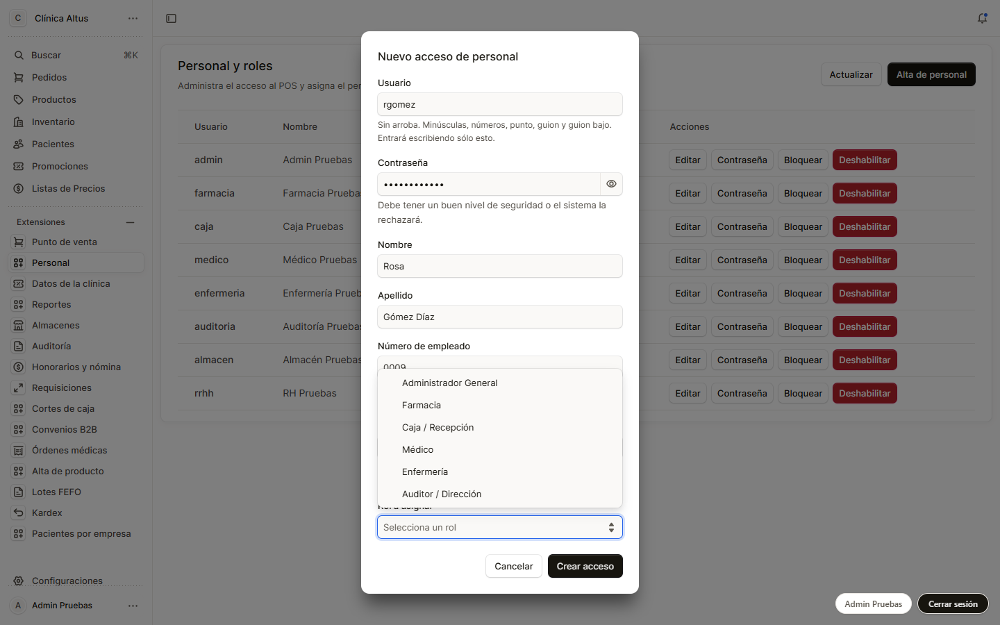

| Rol | A dónde entra |
|---|---|
| **Administrador General** | Al panel, y también al punto de venta con las pantallas de Caja |
| **Almacén** | Existencias, lotes y compras, requisiciones, traspasos, conteos, bajas, costos y reportes de inventario |
| **Farmacia** | Existencias (consulta) y recetas de mostrador: surtir, y reducir con motivo |
| **Caja / Recepción** | Entra a la **Caja**; venta, pacientes, órdenes y cortes |
| **Médico** | Su encabezado de receta, catálogo con existencias, pacientes, recetas y su turno |
| **Enfermería** | Entra a la **Bandeja**; su almacén, recetas propias y su turno |
| **Auditor / Dirección** | Sólo lectura: bitácora, reportes, kardex, caducidades y cortes |
| **RH y contabilidad** | Reportes de actividad, nómina y pagos, cortes; nada clínico |

Cada persona tiene **un** rol. Si alguien cambia de puesto, se le edita el rol; no se le crea una
segunda cuenta.

### 3.4 Los datos del médico para su receta

Con el rol **Médico**, el formulario pide además los **Datos para la receta**: **cédula profesional**
y **universidad** (obligatorias), especialidad y su cédula, teléfono y domicilio del consultorio si no
es el de la clínica, y el **logotipo del médico**. Salen impresos en cada receta y en la pantalla de
inicio del médico, que no puede cambiarlos.

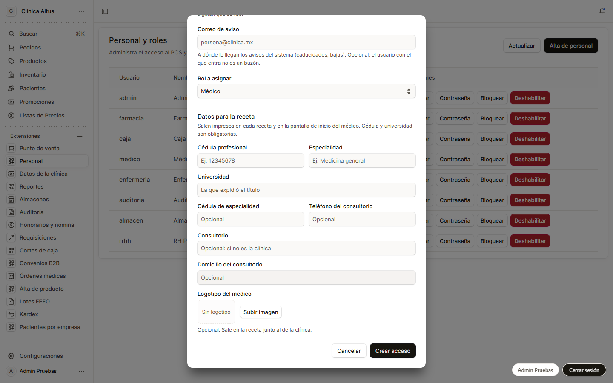

### 3.5 Bloquear, deshabilitar y contraseñas

- **Contraseña** pide una nueva y la cambia en el acto. Nadie, ni Administración, puede leer la actual.
- **Bloquear** cierra la puerta sin dar de baja: al intentar entrar, la persona ve «Cuenta bloqueada».
  Se revierte con **Reactivar**.
- **Deshabilitar** da de baja la cuenta. Es para quien ya no trabaja aquí.

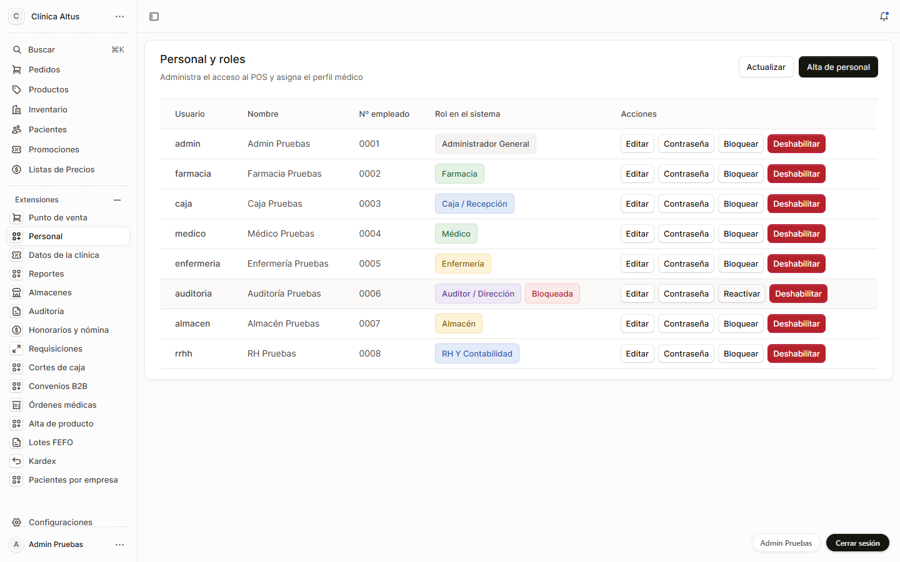

> Bloquear o deshabilitar a alguien **no borra nada de lo que hizo**: sus ventas, sus recetas y sus
> asientos en la bitácora siguen ahí con su nombre.

---

## 4. Datos de la clínica

**Datos de la clínica** configura lo que se imprime en el ticket y en la receta: nombre, domicilio,
teléfono, RFC, el **logotipo de la clínica** (sale en la receta y en la pantalla del médico; el ticket
térmico no lo imprime) y la leyenda del pie del ticket.

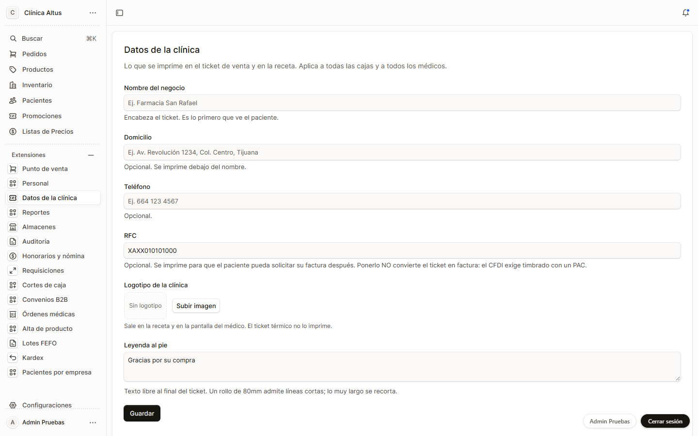

Poner el RFC **no convierte el ticket en factura**: el CFDI exige timbrado con un PAC.

---

## 5. Honorarios y nómina

### 5.1 La nómina del periodo

**Honorarios y nómina** abre la **quincena en curso**. Cada persona con sus turnos, horas, pago fijo,
pago por hora, la **base comisionable** (lo que se le atribuye), la comisión y el total. Quien ya
tiene un pago en el periodo muestra **Pagado** con el monto y los días; a quien no, **Registrar pago**.
Quien dice **Sin esquema de pago** tiene actividad pero nadie ha definido cómo se le paga.

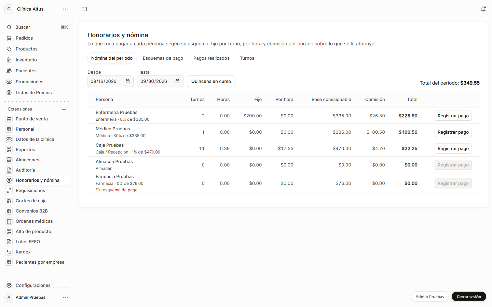

Lo que se atribuye a cada perfil: al **médico**, lo cobrado de sus recetas; a **Enfermería**, lo
cobrado de lo que aplicó; a **Caja**, lo que cobró menos devoluciones; a **Farmacia**, lo que surtió al
precio de venta. Almacén, RH y Administración cobran por turno o por hora.

**Registrar pago** recalcula el monto en el servidor, lo guarda con su desglose congelado y saca el
recibo. Un periodo que se traslapa con uno ya pagado a esa persona no se puede volver a pagar.

### 5.2 Esquemas de pago

**Esquemas de pago** lista a cada persona con su esquema: fijo por turno, por hora, porcentaje base y
reglas por horario. **Definir** o **Editar** abre el editor.

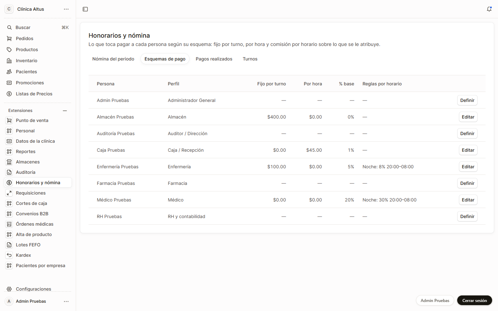

En el editor se combinan las tres formas de pago. Las **reglas por horario** dan un porcentaje
distinto según el día y la hora de la clínica: por ejemplo, el médico cobra 20 % de lunes a viernes de
día y 30 % de noche. Una franja que cruza la medianoche (20:00–08:00) cuenta en el día en que empieza.

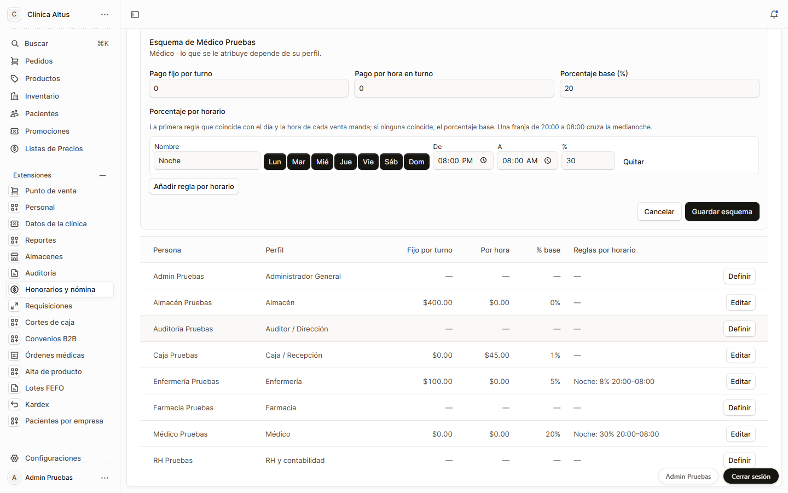

### 5.3 Pagos realizados

**Pagos realizados** lista cada pago con la fecha, la persona, el periodo, el monto y la referencia,
con su botón para **reimprimir el recibo**. **Anular** deshace un pago registrado por error (a la
persona equivocada, el periodo mal): pide el motivo, el pago sale de la lista con su motivo y quién lo
anuló, y el periodo vuelve a quedar pendiente para registrar el correcto.

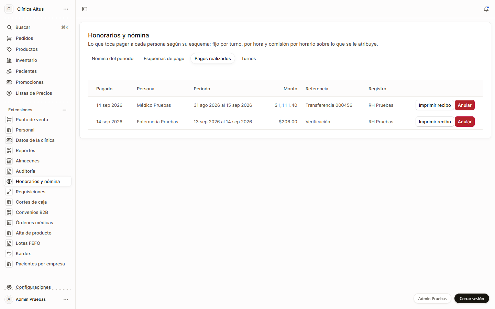

### 5.4 Turnos

**Turnos** muestra quién tiene un turno **abierto ahora** y los turnos **del periodo**. Un turno que
se quedó abierto cuenta horas hasta el momento de la consulta y le infla la nómina a esa persona:
desde aquí se **cierra** o se **corrigen sus horas** con motivo, que queda en el turno y en la bitácora.

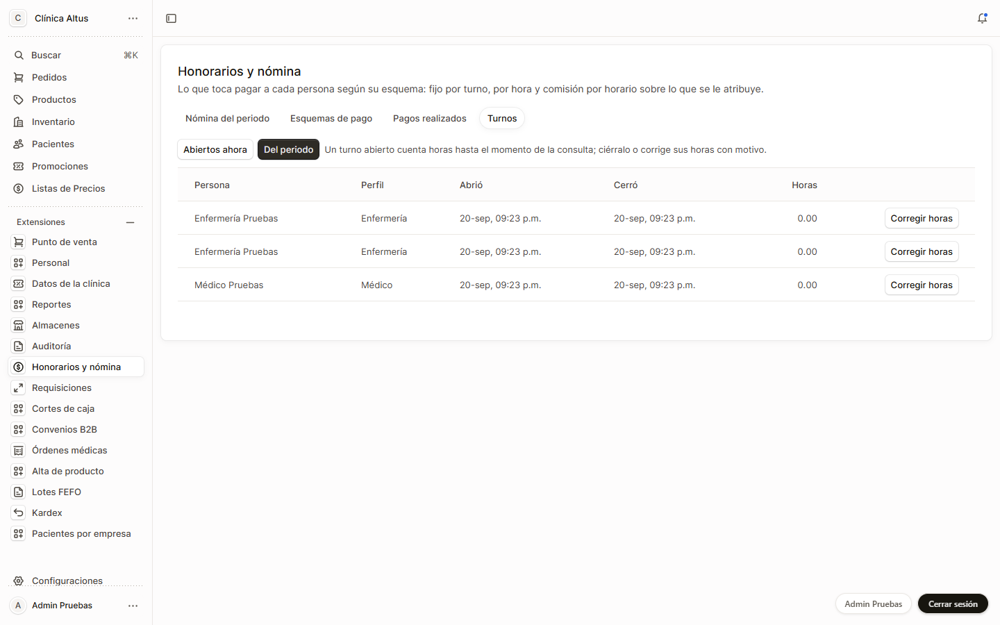

---

## 6. Reportes

**Reportes** reúne todos los reportes del sistema: actividad del personal, honorarios y nómina,
cortes, ventas, bitácora, recetas y órdenes, inventario valorizado, movimientos y caducidades. Se
elige el reporte, el periodo y sus filtros, se revisa la muestra y se **descarga para Excel** o se
**imprime** en carta horizontal con el membrete.

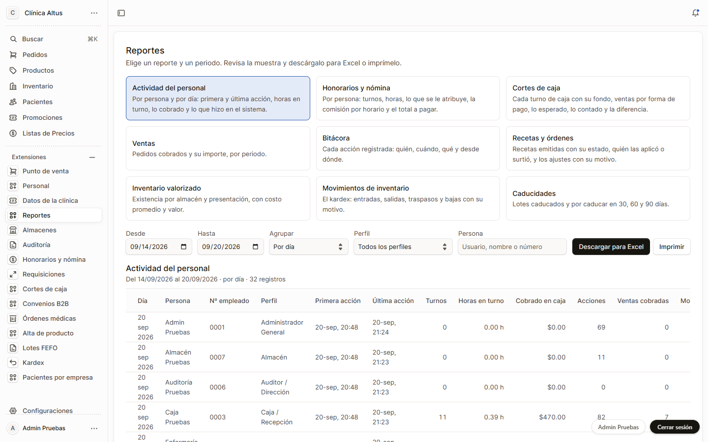

La **actividad del personal** es la base para la nómina: por persona y día, primera y última acción,
turnos, horas, lo cobrado y cuántas acciones de cada tipo. Cada descarga queda en la bitácora.

---

## 7. Caja

**Cortes de caja** lista los turnos con su cajero, apertura, cierre, fondo inicial, ventas,
diferencia y estado. **Ver detalle** abre el corte completo; **Imprimir corte** lo reimprime.

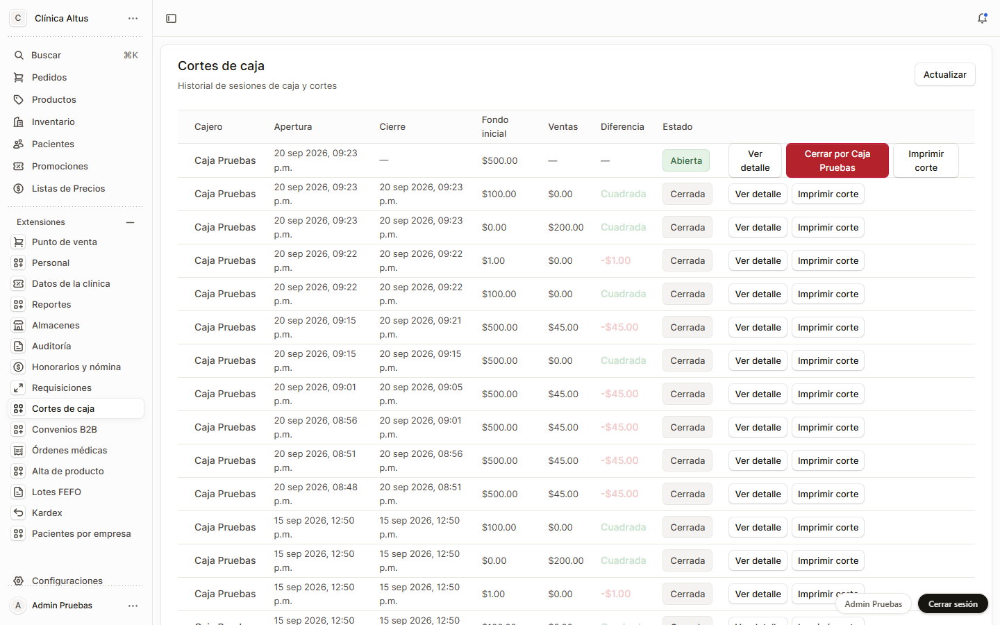

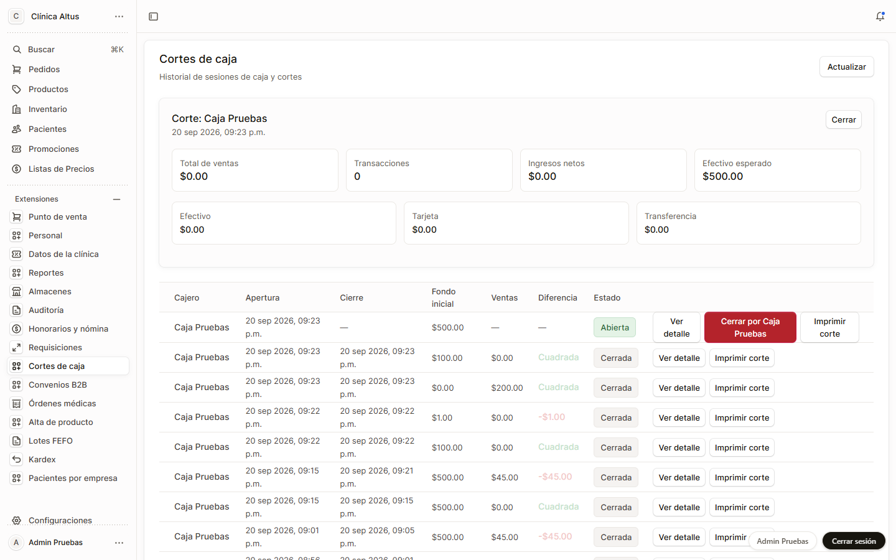

En la clínica hay **una sola caja abierta a la vez**: mientras un turno siga abierto, nadie más puede
abrir otro. Si alguien dejó la caja abierta y se fue, Administración la cierra por esa persona con
**Cerrar por …**: cuenta el efectivo del cajón, escribe el motivo, y el corte dice quién la cerró y
por qué. Sólo quien abrió la caja o Administración pueden cerrarla.

---

## 8. Inventario

### 8.1 Almacenes

**Almacenes** lista cada almacén con su área, cuántas presentaciones, lotes y unidades tiene, y su
**valor** a costo promedio de compra, con el total del inventario. **Imprimir inventario de todos**
saca la hoja de los dos almacenes.

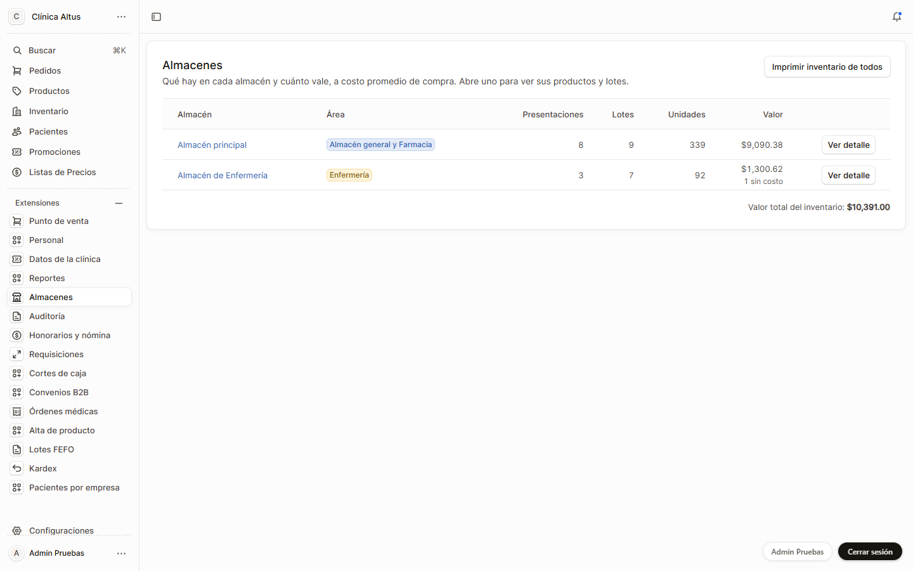

**Ver detalle** abre el almacén: cada presentación con su existencia, mínimo y máximo, lotes, costo
promedio y valor; lo que está **bajo mínimo** se marca en rojo y tiene su filtro. **Fijar mínimo** o
**Editar** cambia el mínimo y el máximo de esa presentación en ese almacén; el aviso de existencias
bajas sale de ahí. Arriba, **Descargar para Excel** e **Imprimir inventario** de ese almacén.

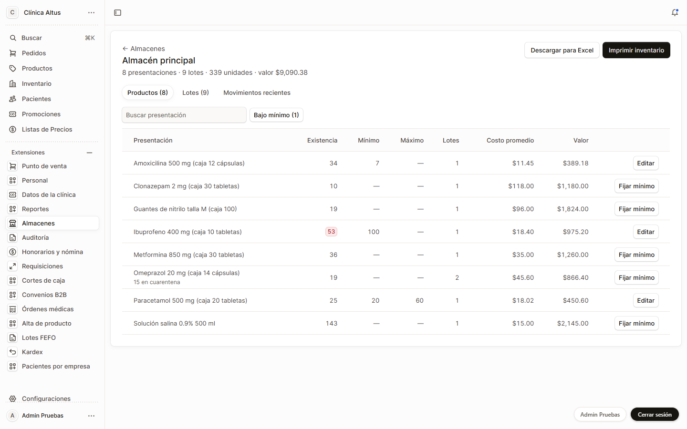

La pestaña **Lotes** muestra cada lote con su caducidad, estante y estado, y **Movimientos recientes**
el kardex de ese almacén.

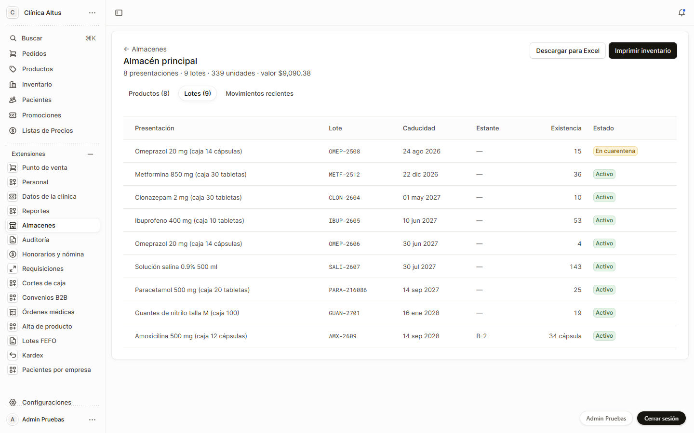

### 8.2 Productos, con su costo

La lista de **Productos** lleva arriba dos tarjetas: **lo que caduca en 90 días** y **Productos y
existencias**, con **Descargar inventario**, **Imprimir inventario** y **Alta de producto con costo**.

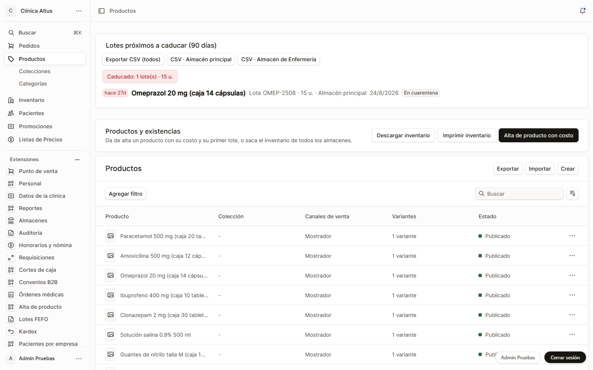

**Alta de producto** da de alta en un solo paso el producto (nombre, genérico, presentación,
proveedor, SKU, código de barras, clasificación y si requiere receta), su **costo** (unidad de compra,
cuántas piezas trae, costo, margen automático y precio de venta, con el precio sugerido y el margen
real calculados) y, si ya llegó, su **primer lote** con almacén, caducidad y estante.

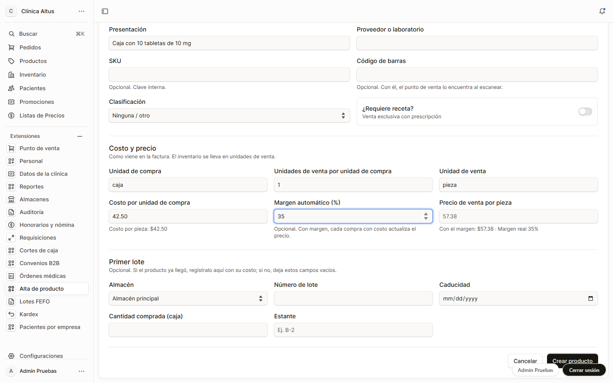

Al abrir un producto existente, el **Expediente del medicamento** empieza por **Costo y precio**: el
precio de venta (editable), el **costo promedio actual** de todas las compras, el margen real, el
precio de compra de referencia y el margen automático. Debajo, la identificación clínica y la
regulación.

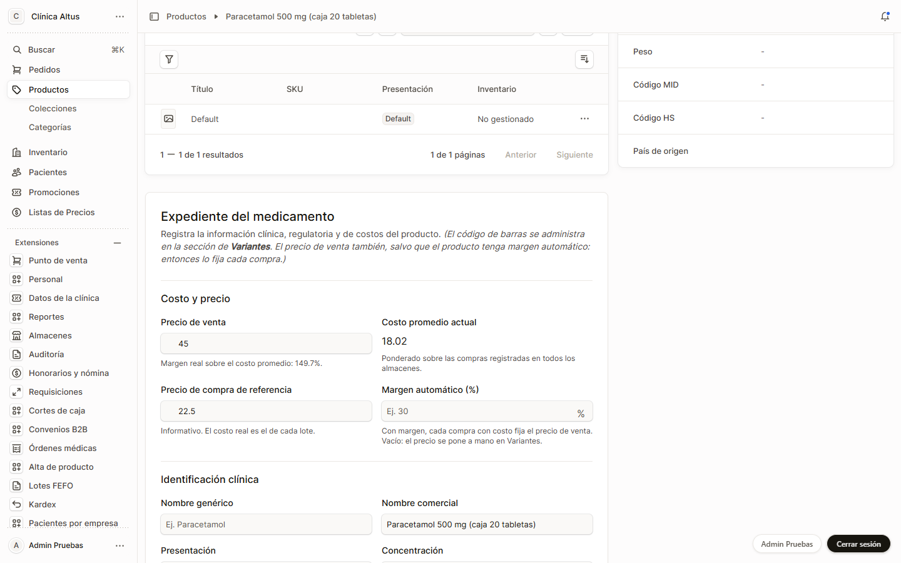

### 8.3 Kardex y lotes FEFO

**Kardex** es el registro de cada movimiento de los dos almacenes: qué presentación, cuánto entró o
salió, de qué lote, con qué costo, quién lo hizo y por qué.

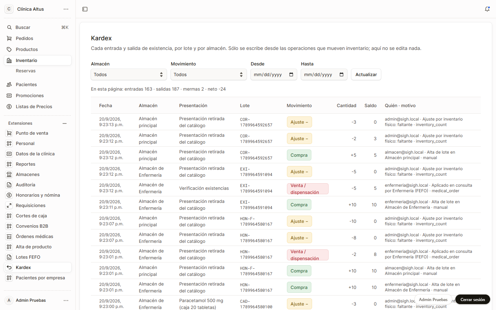

**Lotes FEFO** lista todos los lotes con su almacén, existencia, caducidad y estante. **El que caduca
antes sale primero**. El distintivo dice si está **Vigente**, **Próximo** a caducar o **En cuarentena**.

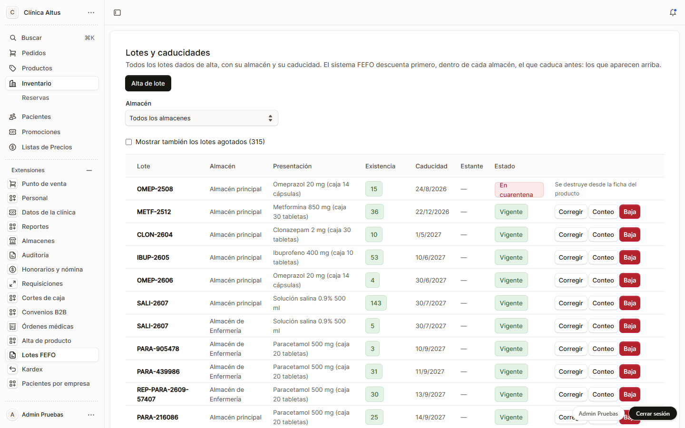

Desde aquí también se trabaja el lote:

- **Alta de lote**: la compra que llegó, con presentación, almacén, número, caducidad, cantidad, costo
  y estante. Entra al kardex como compra.
- **Corregir**: el número que se capturó mal, la caducidad que se leyó mal de la caja, el estante. Pide
  motivo, porque cambiar la caducidad cambia el orden en que se descuenta. La cantidad **no** se
  corrige aquí.
- **Conteo**: lo que contaste; la diferencia entra al kardex como ajuste a tu nombre.
- **Baja**: lo que se rompió o no aparece, con motivo. No se deshace.

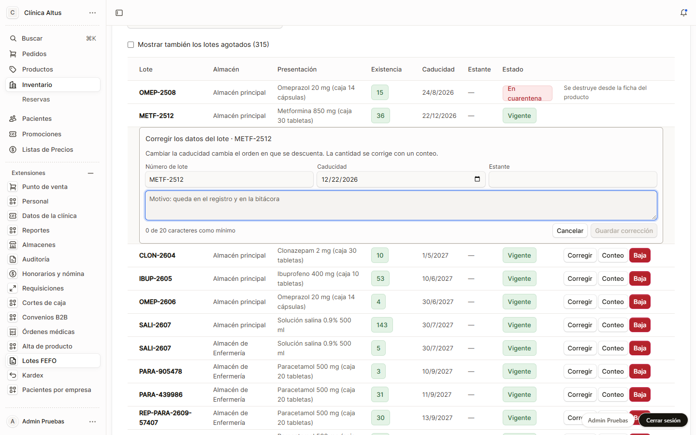

---

## 9. El circuito clínico desde el panel

### 9.1 Órdenes médicas

**Órdenes médicas** abre con lo pendiente de **Farmacia**; los filtros muestran también lo de
Enfermería, lo surtido o aplicado y lo cancelado. Cada orden trae su paciente, quién la emitió, qué
lleva y los **ajustes** que hicieron Enfermería o Farmacia con su motivo. **Validar y surtir** descuenta
del lote que caduca antes y, **si no alcanza, no surte nada**.

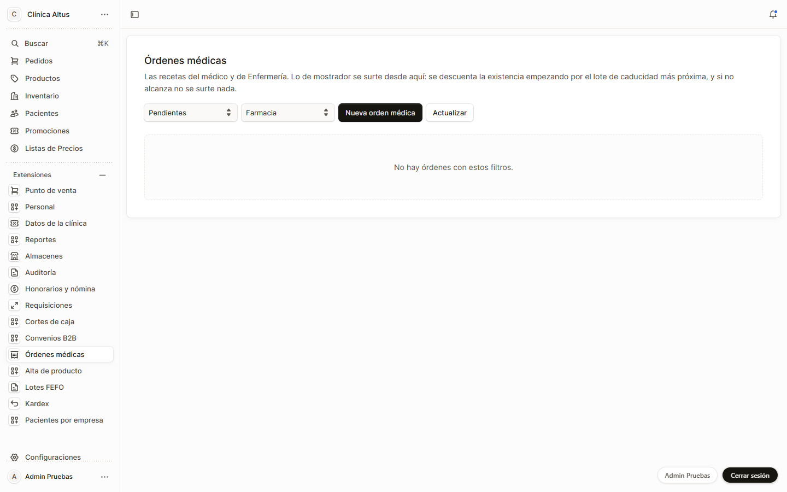

Sobre una orden pendiente, **Ajustar** cambia cantidades, quita renglones o añade material, y
**Cancelar receta** la retira; los dos piden motivo, que el médico ve en Mis recetas y Auditoría en
el reporte de recetas.

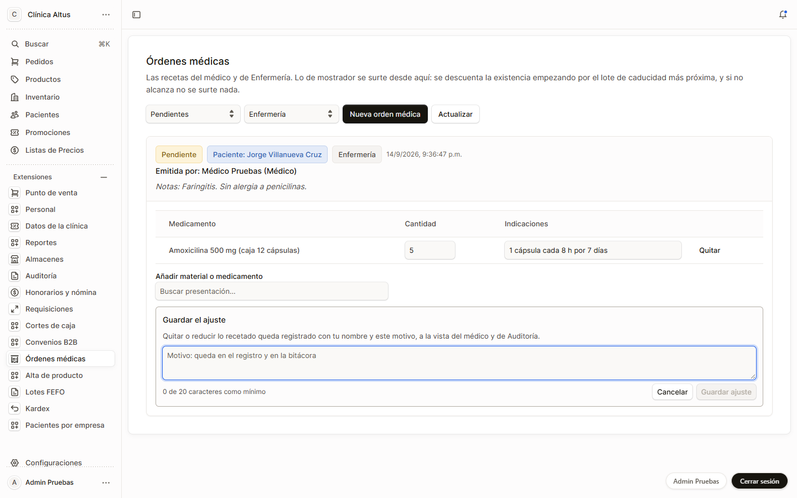

### 9.2 Requisiciones

**Requisiciones** muestra lo que Enfermería pidió, con lo pedido y lo surtido, y si viene de una orden
de la bandeja. La surte **Almacén** (o Administración): sale del almacén general y entra a Enfermería
con el mismo lote y su costo. Administración también puede **pedir una** (un urgente que Enfermería
no alcanzó a capturar), **cancelar** una pendiente con motivo y **confirmar que llegó** una surtida.

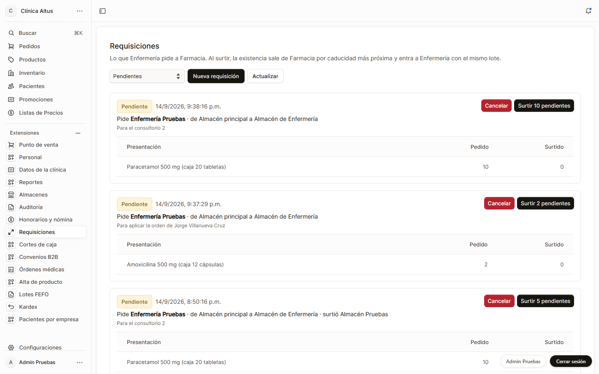

> Antes de surtir, el panel **pregunta con un aviso del navegador** y, al terminar, informa con otro.
> Hay que aceptarlos para que la acción ocurra.

---

## 10. Empresas y convenios

**Convenios B2B** administra las empresas con acuerdo: contacto, condiciones, límite de crédito y
plazo de pago. **Pacientes por empresa** los agrupa para revisar quién está cubierto.

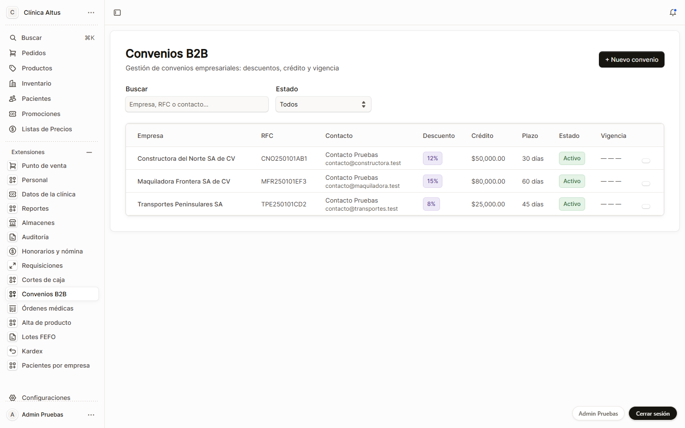

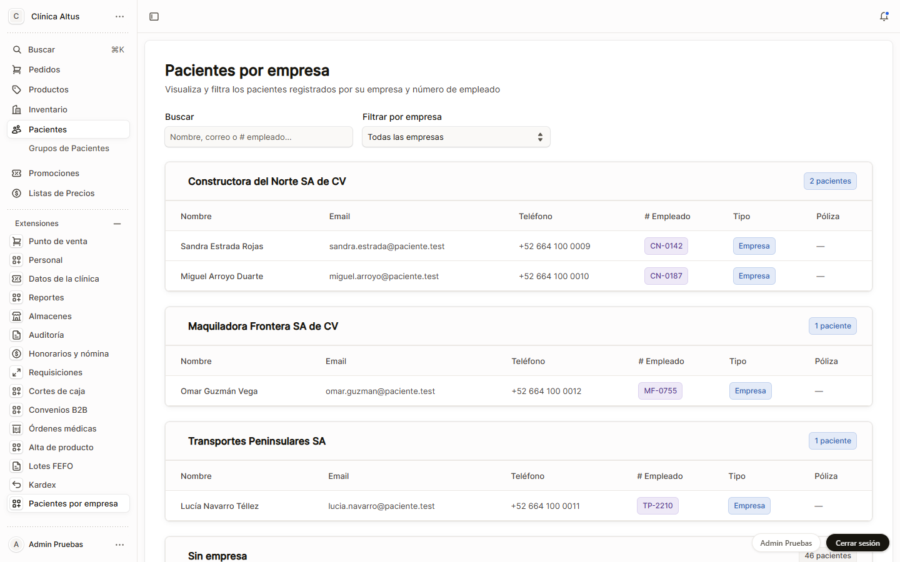

---

## 11. La ficha del paciente

Al abrir un paciente aparecen los **datos corporativos** —número de empleado, empresa, tipo de
paciente y póliza— y **Generar orden médica o receta**. Los pacientes **no necesitan correo**.

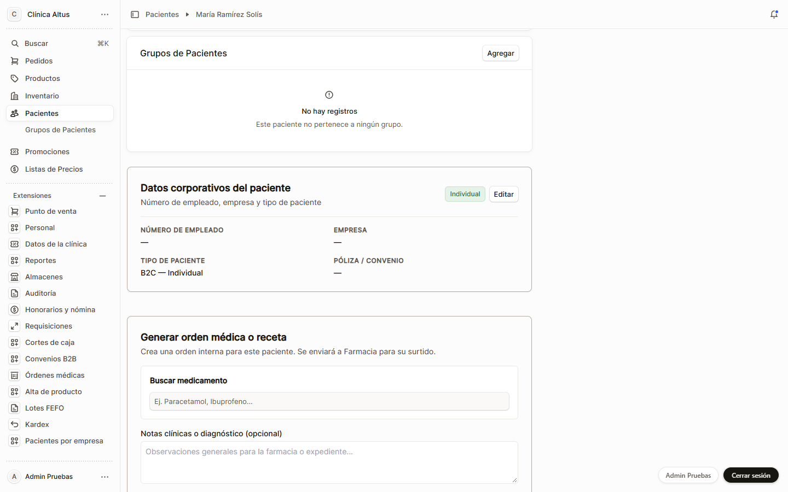

---

## 12. La bitácora

**Auditoría** es la bitácora completa, con filtros por fecha, perfil, usuario, número de empleado y
tipo de acción. Cada asiento dice **en palabras qué hizo** la persona («Corrigió los datos de un lote»,
«Anuló un pago de nómina»), con la hora, quién, desde qué dirección y, en chico, la ruta técnica para
quien audite a fondo.

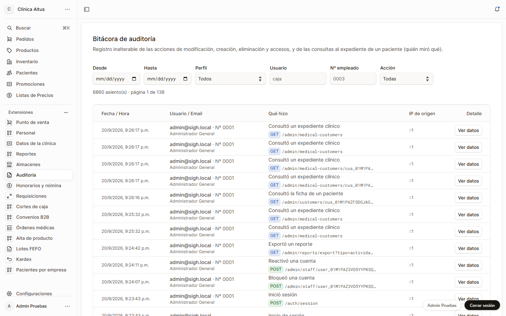

La bitácora **no se puede editar ni borrar desde ninguna pantalla**, y cada asiento guarda la huella
digital del anterior: si alguien manipulara la base de datos por fuera, la verificación lo diría.

---

## 13. Modo oscuro

Se cambia en el menú de tu nombre, abajo a la izquierda, en **Tema**.

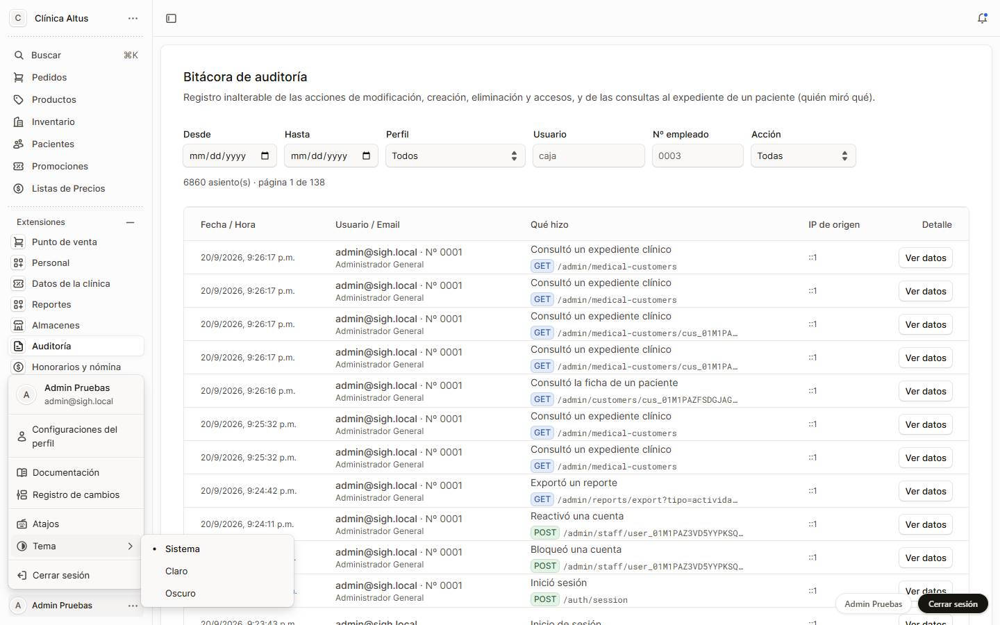

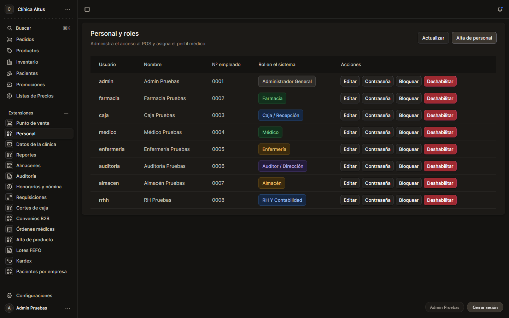

---

## 14. Salir

El botón **Cerrar sesión** flotante abajo a la derecha —que pide confirmación— o la opción del menú de
tu nombre. **Salir del panel cierra también el punto de venta en ese mismo navegador**, y al revés.

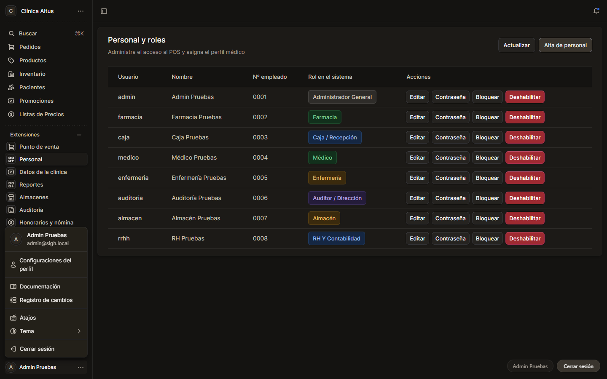

---

## 15. Si algo no sale

| Qué ves | Qué significa | Qué hacer |
|---|---|---|
| Toda la lista de Pedidos dice «No pagado / No cumplido» | Estados internos de Medusa | Ignóralos; lo que vale es el corte de caja |
| «Sin acceso» en una pantalla del panel | Entraste con una cuenta que no es de Administración | Los demás perfiles trabajan en el punto de venta |
| Caja dice «La caja está ocupada» | Otra persona dejó un turno abierto | Que esa persona haga su corte; si ya se fue, Cortes de caja → **Cerrar por …** |
| Una persona tiene horas de más en la nómina | Dejó su turno abierto | Honorarios y nómina → Turnos → **Cerrar ahora** o **Corregir horas** |
| Se registró un pago equivocado | El periodo quedó marcado como pagado | Pagos realizados → **Anular**, y registra el correcto |
| Un lote tiene la caducidad mal | Se capturó mal al darlo de alta | Lotes FEFO → **Corregir**, con motivo |
| El médico ve un aviso de datos incompletos | Falta su cédula o universidad | Personal → Editar → Datos para la receta |
| «Sin esquema de pago» en la nómina | Nadie definió cómo se le paga | Esquemas de pago → Definir |
| «Ese periodo ya se pagó» | Hay un pago que se traslapa | Revisa Pagos realizados; paga sólo los días que faltan |
| Un almacén dice «N sin costo» | Hay lotes dados de alta sin costo | Corrige el costo del lote; el valor no los cuenta |
| Al surtir: «no se surte nada» | A algún renglón no le alcanza la existencia | Revisa los lotes; da de alta lo que llegó |
| Alguien no puede entrar y dice «Cuenta bloqueada» | Su cuenta está bloqueada | Personal → **Reactivar** |
| Un número de empleado se rechaza | Ya lo tiene otra cuenta, incluso una deshabilitada | Usa uno nuevo |
| Una acción no ocurre y no pasa nada | Un aviso del navegador quedó sin aceptar | Acepta el aviso; permítelos para este sitio |

---

*Este manual se genera a partir de un recorrido real del sistema. Las capturas se regeneran con
`npm run administracion` dentro de `docs/manual/`, con el panel compilado y servido (variable
`PANEL`); el texto se revisa a mano cuando cambia una pantalla.*
