# Manual de uso · Auditoría / Dirección

Punto de venta Altus · tableta apaisada · versión del 14 de septiembre de 2026

Este manual describe lo que ve y lo que hace quien revisa la operación con el perfil **Auditoría /
Dirección**. Está escrito para quien va a usar el sistema, no para quien lo programa, y cada paso
lleva la pantalla tal como se ve en la tableta.

Las capturas se tomaron con la cuenta de pruebas «Auditoría Pruebas». En la clínica aparecerán los
nombres reales.

---

## 1. Qué hace Auditoría

Auditoría **mira, no toca**. Es el perfil para revisar: quién hizo qué y cuándo, cómo se movió el
inventario, qué está por caducar y si la caja cuadró. Todo lo que ve es de sólo lectura, y no por
costumbre: **el servidor rechaza cualquier escritura de esta cuenta**, aunque se intente desde
fuera de la aplicación. Por eso tampoco hay botones que lleven a una negativa.

| Puede | No puede |
|---|---|
| Leer la **bitácora** completa, con filtros por fecha, perfil y texto | Borrar, editar ni ocultar un asiento de la bitácora |
| Ver el **kardex** de los dos almacenes, con lote, motivo y persona | Dar de alta, de baja ni ajustar existencia |
| Ver las **caducidades** de los dos almacenes y **descargar el CSV** | Destruir lotes en cuarentena ni sacarlos de ella |
| Ver los **cortes de caja** cerrados y **reimprimir** cualquiera | Abrir o cerrar un turno de caja, ni registrar movimientos de efectivo |
| Ver el agregado de ventas **por semana o por mes** | Cobrar, surtir, aplicar ni emitir recetas |
| Sacar **reportes** para Excel o impresos: actividad del personal, nómina, cortes, ventas, bitácora, recetas, inventario, movimientos y caducidades | Registrar pagos de nómina: eso es de RH |
| — | Ver el expediente clínico de los pacientes |
| — | Entrar al panel de administración |

Las consultas de Auditoría **también quedan registradas** en la bitácora: auditar deja rastro, como
todo lo demás.

---

## 2. Las pantallas de Auditoría

Seis pestañas abajo. Arriba, la barra de sesión: quién está trabajando, **Pausar** y **Salir**.

| Pestaña | Para qué sirve |
|---|---|
| **Bitácora** | Quién hizo qué y cuándo, encadenado por huella digital. **Es la pantalla de entrada** |
| **Reportes** | Todos los reportes, con muestra, descarga para Excel e impresión |
| **Kardex** | Cada movimiento de inventario de los dos almacenes, con su lote y su motivo |
| **Caducidad** | Lo que vence en 90 días y lo que ya venció, con exportación a CSV |
| **Cortes** | Los turnos de caja cerrados, y el agregado de ventas por periodo |
| **Ajustes** | Datos del equipo (canal, región, ubicación) y cerrar sesión |

No aparecen para Auditoría: Productos, Pacientes, Órdenes, Caja, ni el botón «Panel».

---

## 3. La bitácora

### 3.1 Entrar

Escribe tu **usuario** (`auditoria`, o el que te dieron, sin arroba) y tu contraseña, y pulsa
**Entrar**.

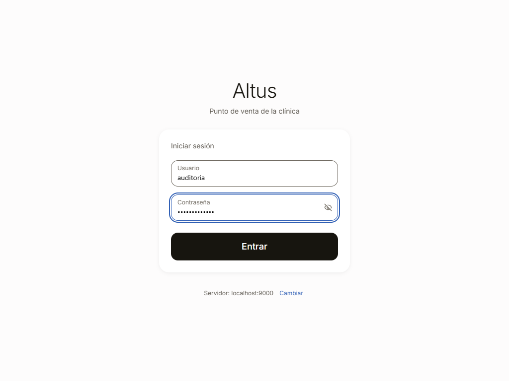

### 3.2 Lo que ha pasado

Aterrizas en la **Bitácora**, con los últimos siete días. Cada renglón es una acción: quién la
hizo (usuario, perfil y número de empleado), qué hizo en una frase, cuándo, y debajo en gris el
dato técnico —el método y la ruta— para quien lo necesite.

El punto de color dice de qué tipo fue: **verde** creó algo, **azul** lo modificó, **rojo** lo
borró, **gris** sólo lo consultó. Los accesos al sistema aparecen como «Inicio de sesión» y no
llevan perfil, porque se asientan antes de saber quién entró.

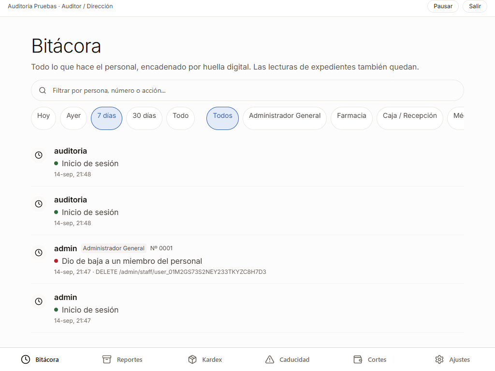

### 3.3 Acotar por fecha

La primera fila de filtros es el rango: **Hoy**, **Ayer**, **7 días**, **30 días** y **Todo**.
«Ayer» es un solo día —de las cero a las veinticuatro horas—, no las últimas veinticuatro horas;
es lo que se quiere cuando alguien pregunta «qué pasó ayer en la clínica».

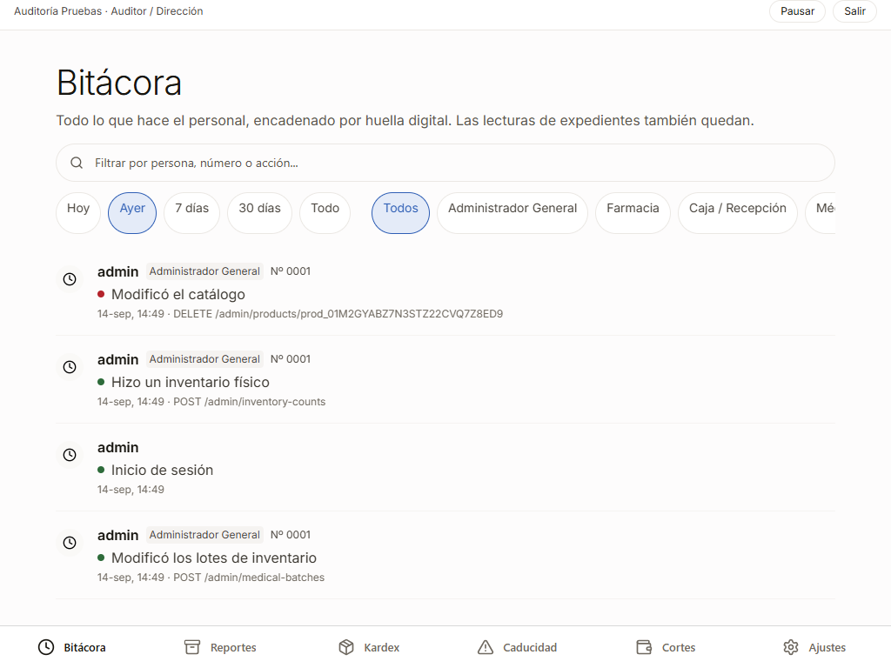

### 3.4 Acotar por perfil

La segunda fila filtra por perfil: **Todos**, Administrador General, Farmacia, Caja / Recepción,
Médico, Enfermería, Auditoría. Sirve para la pregunta más habitual de una revisión: «todo lo que
hizo Farmacia esta semana».

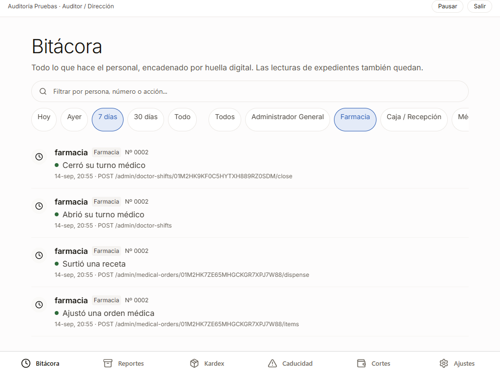

### 3.5 Buscar

El buscador filtra por **persona, número de empleado, perfil o acción**, sin importar acentos ni
mayúsculas. Buscar «caja» trae tanto lo que hizo la cuenta de caja como todo lo que menciona la
caja: abrirla, cerrarla, registrar un movimiento.

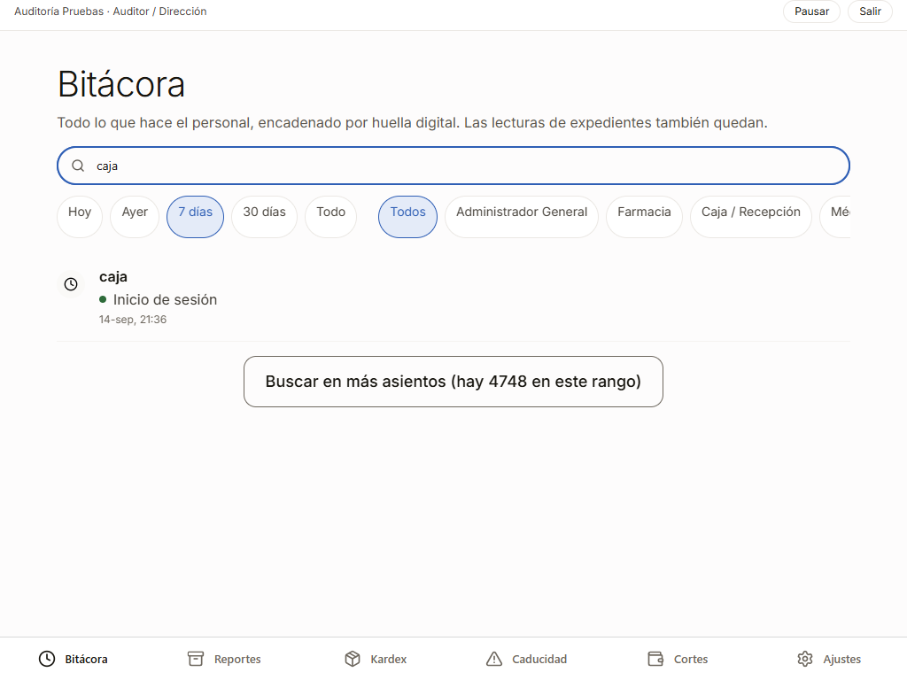

**Importante:** el buscador filtra sobre lo que ya se trajo del servidor, no sobre la bitácora
entera. Si no encuentra nada, la pantalla lo dice con todas sus letras —«ninguno de los 50 asientos
cargados»— y ofrece **Buscar en más asientos**. Púlsalo hasta encontrarlo o hasta agotar el rango.

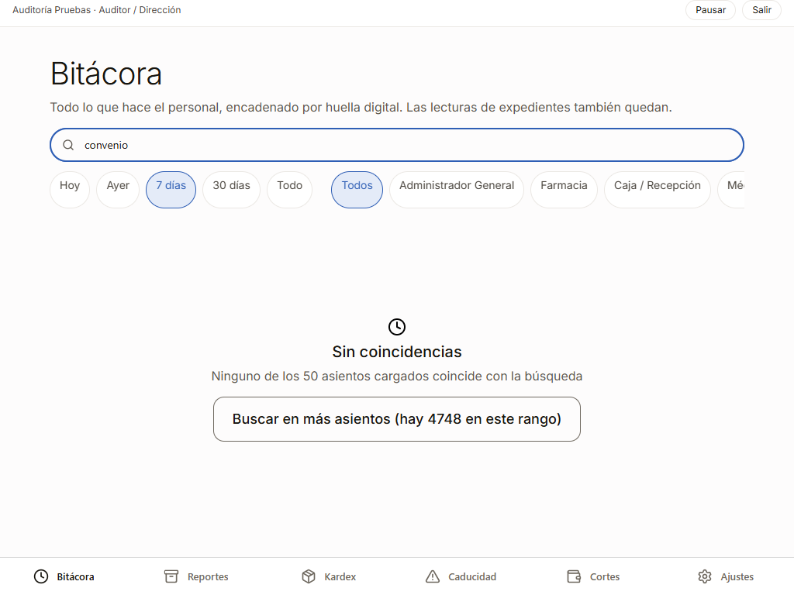

### 3.6 Traer más

Sin búsqueda, el pie de la lista dice de cuántos asientos estás viendo una parte: «Cargar más (50
de 3 356)». Cada pulsación trae cincuenta más.

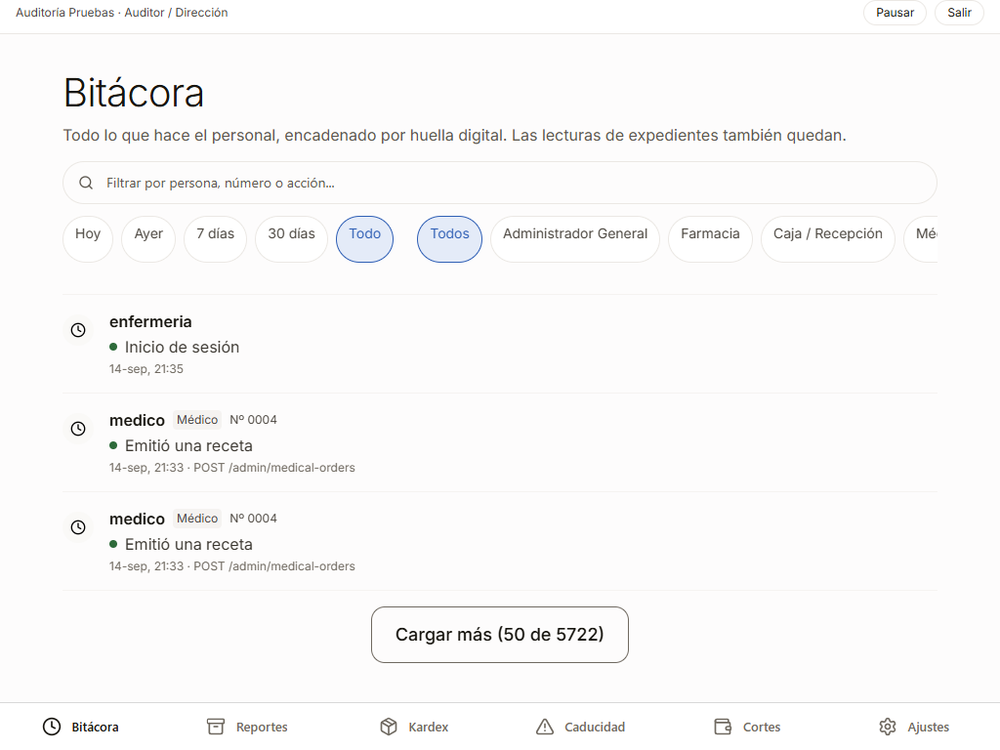

> **Por qué la bitácora es prueba y no sólo un registro.** Cada asiento guarda la huella digital
> del anterior, así que forman una cadena: si alguien borrara o cambiara uno, los siguientes
> dejarían de cuadrar. Administración puede comprobarlo en cualquier momento con la verificación de
> la cadena, que recorre todos los asientos y dice si alguno fue tocado.

---

## 4. El kardex

### 4.1 Cada movimiento de inventario

**Kardex** lista los movimientos de los dos almacenes, el más reciente primero: qué presentación,
cuánto entró o salió, de qué lote, en qué almacén, qué saldo quedó, quién lo hizo y por qué.
Arriba, el resumen del rango: **entradas**, **salidas** y **mermas**.

Filtra por almacén (Los dos, Farmacia, Enfermería), por rango de fechas y por tipo de movimiento.

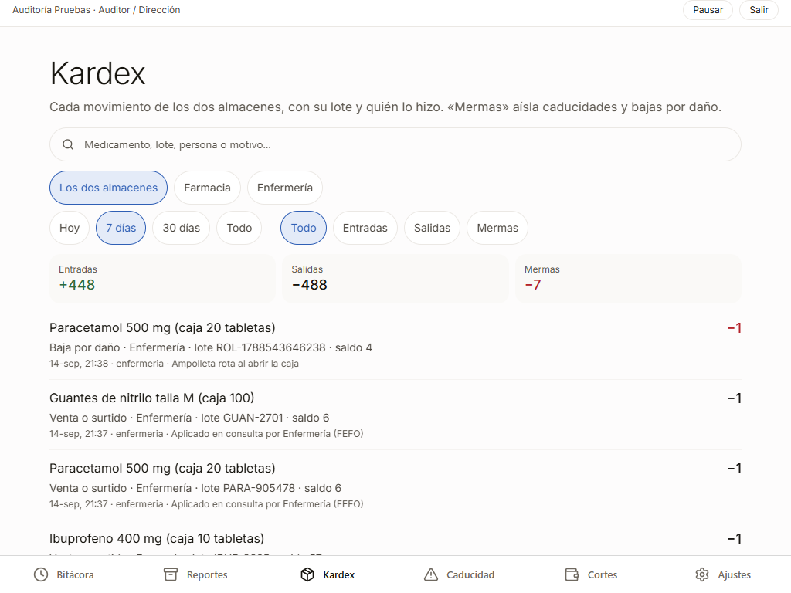

Si una presentación ya no está en el catálogo, el renglón dice **«Presentación retirada del
catálogo»** y deja el identificador en la línea pequeña: el movimiento no se oculta nunca —es parte
del historial— pero tampoco se encabeza con un código que no se lee.

### 4.2 Mermas

**Mermas** aísla lo que se perdió: bajas por daño y caducidades, cada una con el motivo que
escribió quien la registró. Es la vista de la revisión mensual.

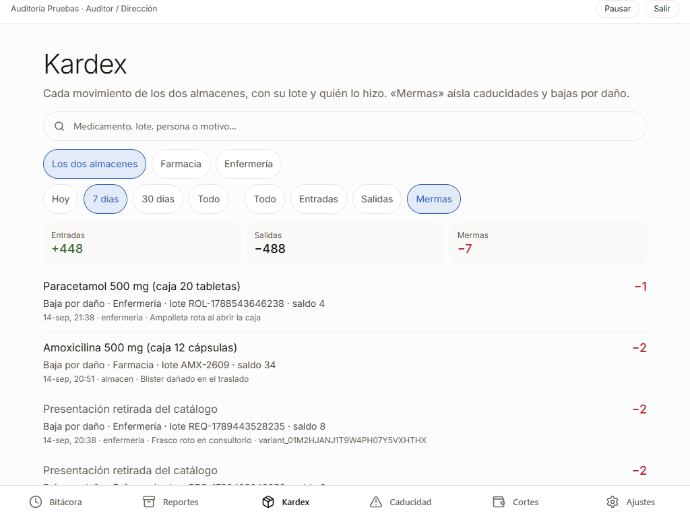

### 4.3 Un solo almacén

Con el chip de almacén se separa lo de Farmacia de lo de Enfermería. Un traspaso aparece dos veces
—«Traspaso enviado» en el de origen y «Traspaso recibido» en el de destino—, con el mismo lote:
así se sigue el rastro de una caja de un almacén al otro.

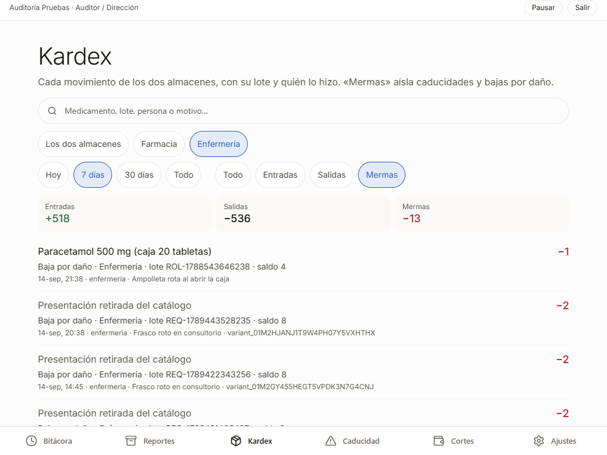

---

## 5. Caducidades

### 5.1 Lo que está por vencer

**Caducidad** reparte en cuatro casillas lo que caduca en los próximos 90 días y lo que ya caducó:
**caducado**, **30 días o menos**, **31 a 60** y **61 a 90**. Cada renglón trae el lote, la fecha,
cuánto queda, en qué almacén está y si ya pasó a cuarentena.

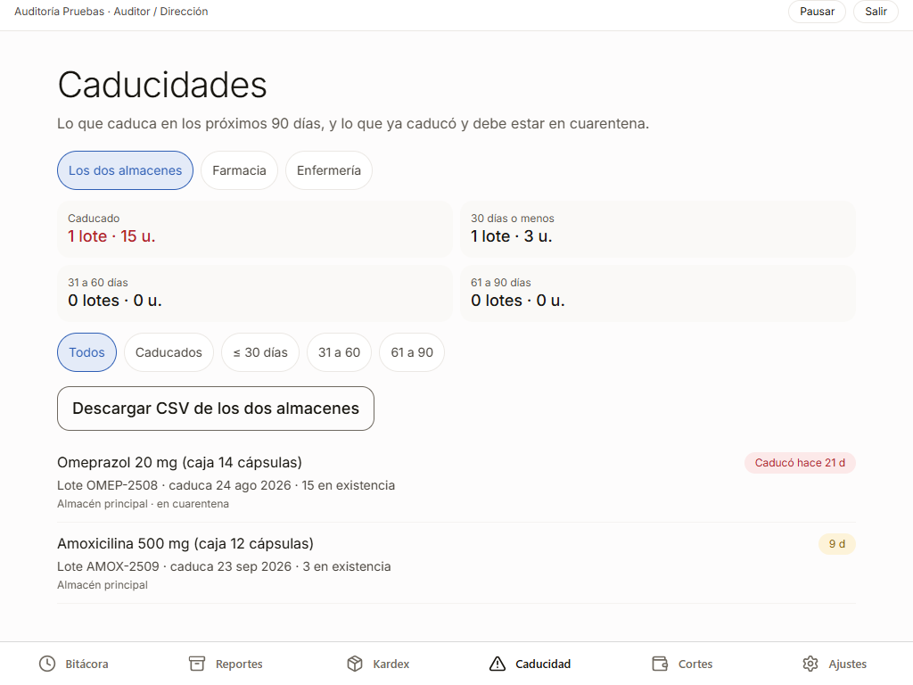

Tocar una casilla —o un chip— deja sólo ese tramo. **Caducados** es el que importa en una
revisión: lo que ya venció debería estar en cuarentena y salir del almacén.

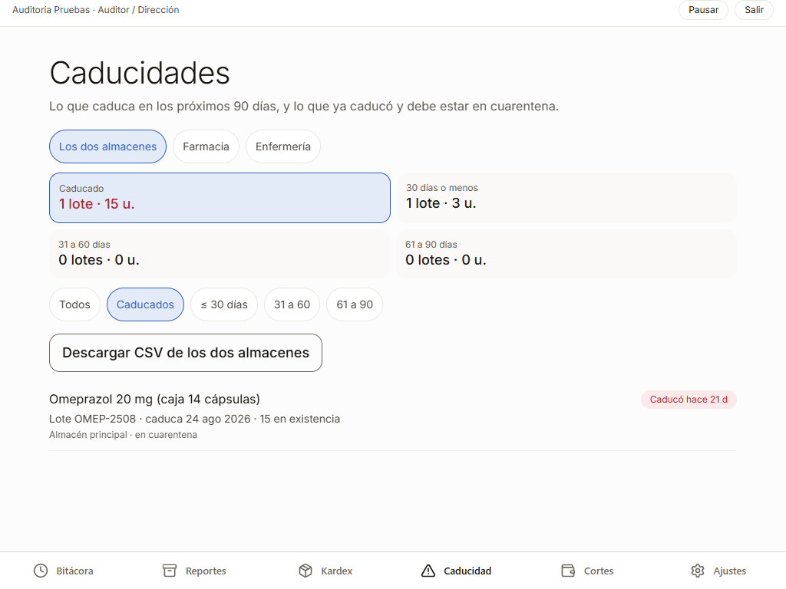

### 5.2 Llevárselo a una hoja de cálculo

**Descargar CSV** guarda la lista como archivo, del almacén elegido o de los dos. El aviso confirma
el nombre del archivo; se guarda en la carpeta de descargas del equipo.

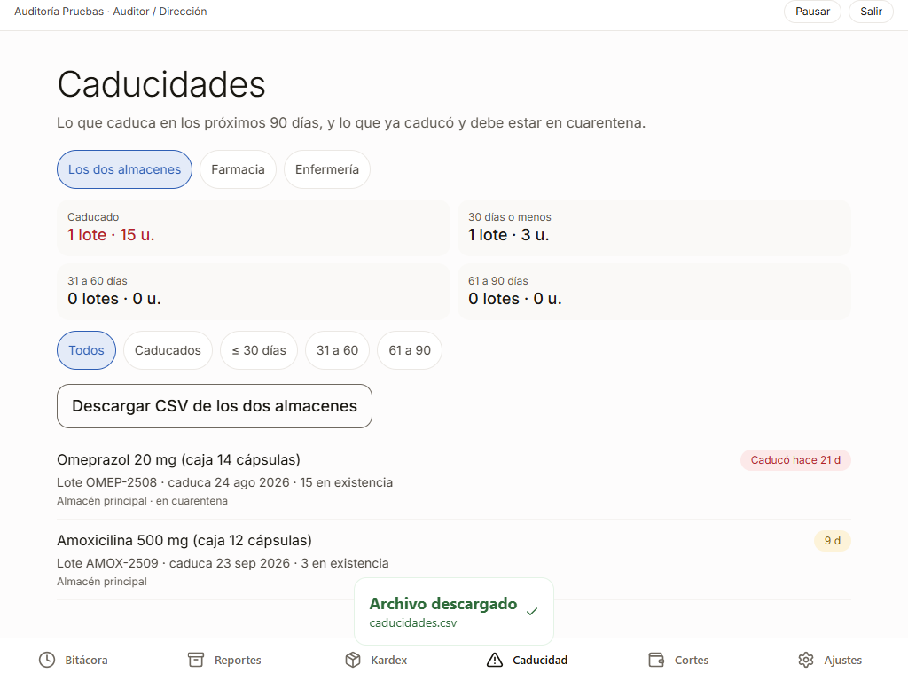

---

## 6. Cortes de caja

### 6.1 Turno por turno

**Cortes** lista los turnos **cerrados**, con quién los llevó, cuándo se abrió y se cerró, el
**fondo**, lo **esperado** y lo **contado**. El distintivo de la derecha resume lo único que
importa de un vistazo: **Cuadró**, **Sobrante** o **Faltante**, con el importe. Si quien cerró
dejó observaciones, van entrecomilladas.

**Imprimir corte** reimprime el mismo comprobante que sacó Caja, con la misma aritmética.

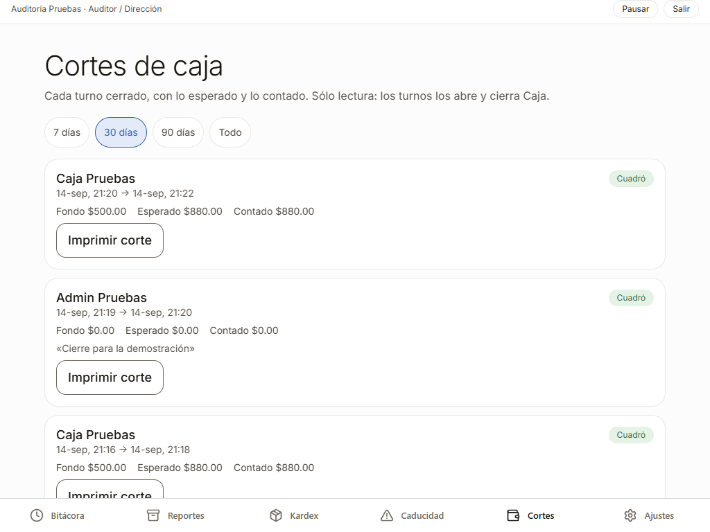

Un turno abierto no aparece: todavía está recibiendo ventas y su corte no existe. Aparecerá en
cuanto se cierre.

### 6.2 Por periodo

Debajo, las ventas de los turnos cerrados del rango, agrupadas **por semana** o **por mes**, con el
desglose de efectivo, tarjeta y transferencia y cuántos turnos entraron en la suma.

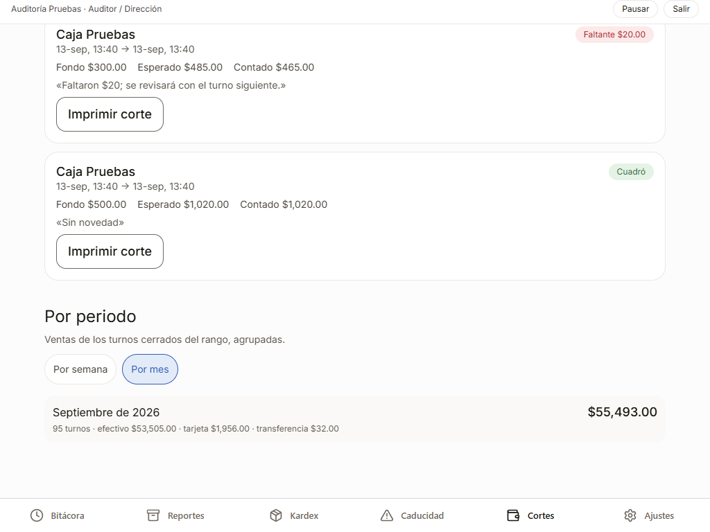

---

## 7. Reportes

### 7.1 Elegir el reporte

**Reportes** reúne en una sola pantalla todo lo que Auditoría puede sacar del sistema para Excel o
en papel. Arriba, cada reporte con lo que contiene; debajo, el **periodo** y los filtros del que
elijas, y una **muestra** con los primeros renglones. Nada se descarga a ciegas.

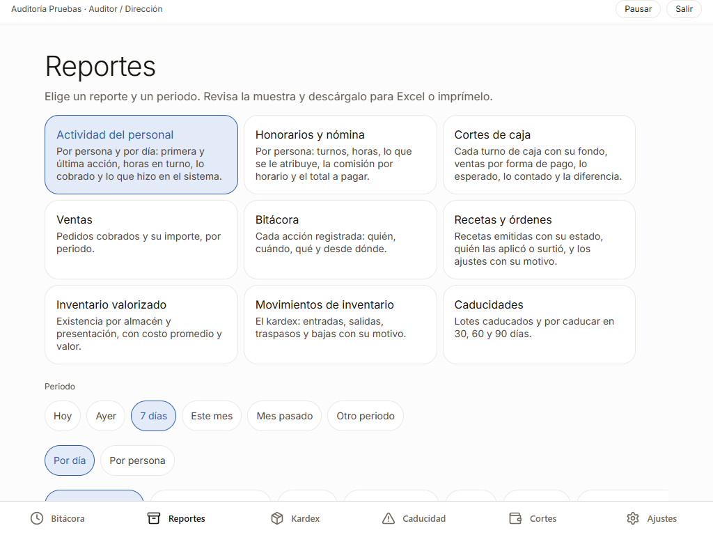

| Reporte | Qué trae |
|---|---|
| **Actividad del personal** | Por persona y día: primera y última acción, turnos, horas, lo cobrado y cuántas acciones de cada tipo |
| **Honorarios y nómina** | Lo que toca a cada persona en el periodo, con su desglose y si ya se pagó |
| **Cortes de caja** | Cada turno con fondo, ventas por forma de pago, esperado, contado y diferencia |
| **Ventas** | Lo cobrado por día, semana o mes |
| **Bitácora** | Cada acción registrada, filtrable por perfil y persona |
| **Recetas y órdenes** | Cada receta con su estado, quién la aplicó o surtió, y **los ajustes con su motivo** |
| **Inventario valorizado** | Existencia por almacén con costo promedio y valor |
| **Movimientos de inventario** | El kardex del periodo |
| **Caducidades** | Lo caducado y lo que vence en 30, 60 y 90 días |

### 7.2 Revisar la muestra

**Recetas y órdenes** es el reporte para revisar lo clínico sin leer expedientes: folio, fecha,
paciente, quién prescribió, a dónde fue, en qué estado quedó y, cuando Enfermería o Farmacia quitaron
o redujeron algo, quién lo hizo y por qué.

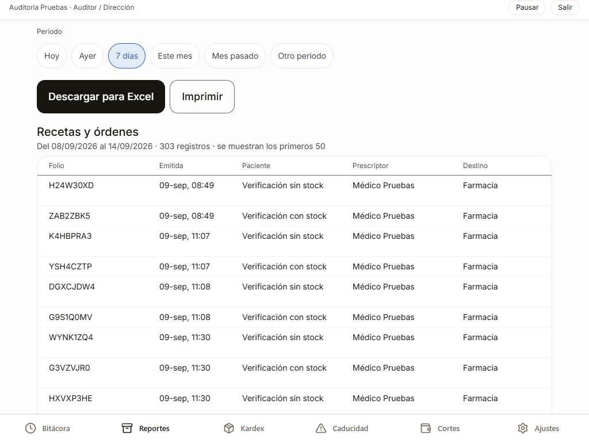

**Inventario valorizado** no pide periodo: es la existencia de hoy. Se puede acotar a un almacén.

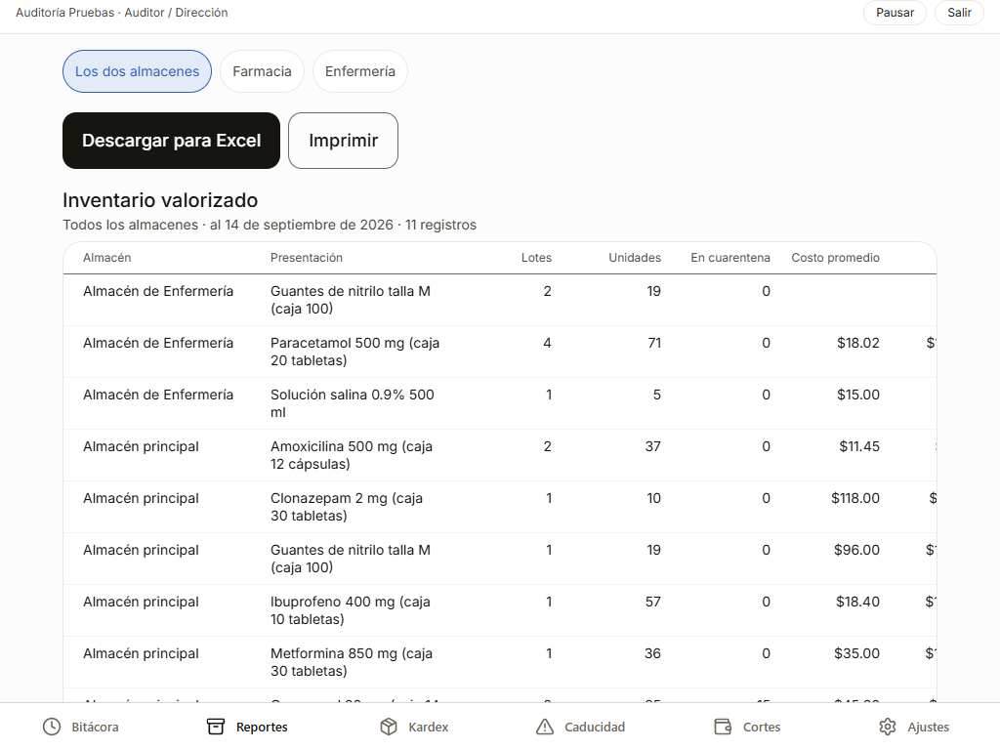

### 7.3 Descargar o imprimir

**Descargar para Excel** baja el archivo completo (no sólo la muestra), con acentos y fechas bien
escritos. **Imprimir** saca la hoja **carta horizontal** con el membrete de la clínica, el periodo,
los totales y quién la generó y cuándo.

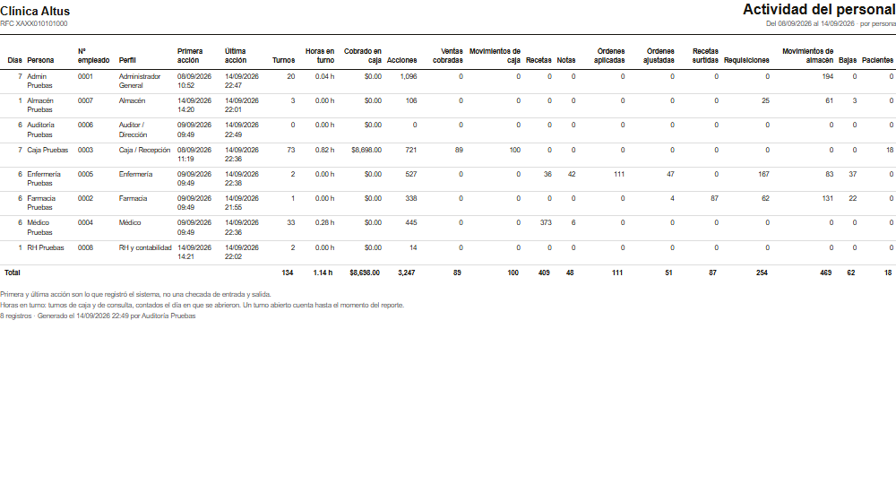

Cada descarga e impresión queda en la bitácora con el reporte y el periodo.

---

## 8. Ajustes

**Ajustes** muestra con qué canal, región y ubicación de inventario trabaja este equipo, y deja
cerrar sesión. La nota de arriba lo resume: Auditoría consulta, imprime y exporta, pero no modifica
nada.

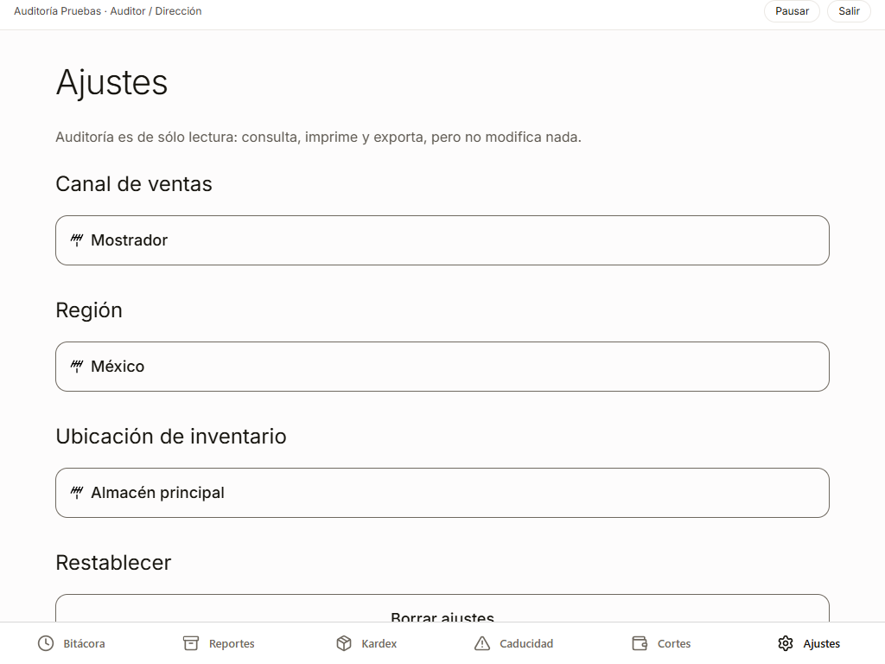

---

## 9. Lo que Auditoría no puede hacer, y cómo se ve

Si intenta entrar a una pantalla de Caja o de Almacén por una dirección directa, el sistema la
devuelve a la bitácora. No hay pestañas de venta ni de almacén, y el servidor rechaza cualquier
intento de escribir —cobrar, surtir, dar de baja, tocar un lote— aunque se haga fuera de la
aplicación.

---

## 10. Pausar y salir

**Pausar** bloquea la pantalla sin cerrar nada; para volver, tu contraseña y **Continuar**. También
se pausa sola tras un rato sin actividad. **Salir** pide **Confirmar salida**. Como aquí no se
escribe nada, no hay nada que perder: los filtros vuelven a su estado inicial la próxima vez.

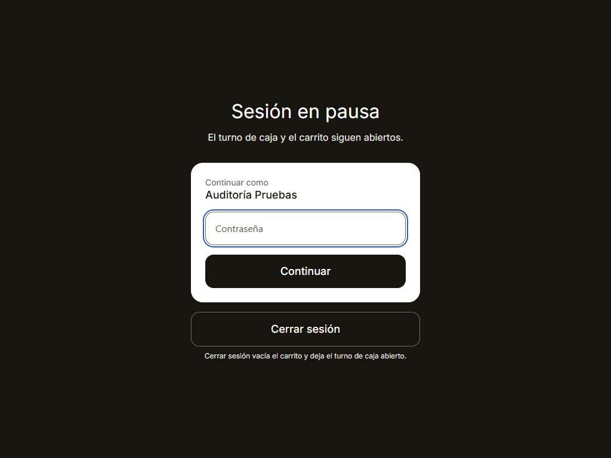

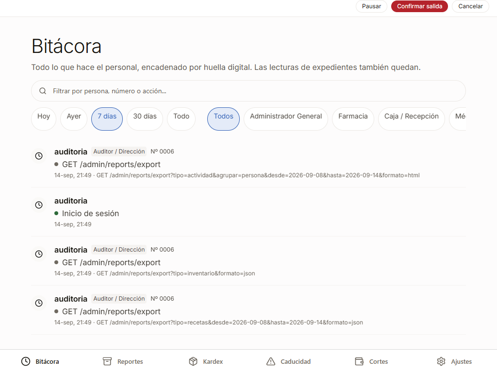

---

## 11. Si algo no sale

| Qué ves | Qué significa | Qué hacer |
|---|---|---|
| «Sin coincidencias» buscando algo que sabes que pasó | El buscador filtra lo ya cargado, no toda la bitácora | Pulsa «Buscar en más asientos», o acota primero por fecha y perfil y busca después |
| La bitácora sale vacía en «Hoy» | Nadie ha hecho nada todavía hoy, o el rango es el equivocado | Prueba «Ayer» o «7 días» |
| Un renglón del kardex dice «Presentación retirada del catálogo» | El producto se dio de baja después del movimiento | El movimiento es válido; el identificador de la línea pequeña sirve para rastrearlo |
| Un turno de caja no aparece en Cortes | Sigue abierto, o quedó fuera del rango | Amplía el rango; si sigue abierto, pídele a Caja que lo cierre |
| Las cifras de «Por periodo» no cuadran con las de un turno | El agregado suma sólo turnos **cerrados** del rango elegido | Comprueba el rango; un turno abierto no entra en la suma |
| Un lote caducado no está en cuarentena | El paso a cuarentena corre cada mañana | Si lleva más de un día, avisa a Almacén y a Administración |
| «Esta cuenta no puede consultar la bitácora» | La cuenta perdió el perfil de Auditoría | Habla con Administración |
| Un reporte dice «se muestran los primeros 50» | La muestra es corta a propósito | «Descargar para Excel» trae todos los renglones |
| «Cuenta bloqueada» al entrar | Administración bloqueó tu cuenta | Habla con Administración; tu clave sigue siendo la misma |

---

*Este manual se genera a partir de un recorrido real del sistema. Las capturas se regeneran con
`npm run auditoria` dentro de `docs/manual/`; el texto se revisa a mano cuando cambia una pantalla.*
