# Manual de uso · Farmacia

Punto de venta Altus · tableta apaisada · versión del 14 de septiembre de 2026

Este manual describe lo que ve y lo que hace quien atiende el mostrador de farmacia con el perfil
**Farmacia**. Está escrito para quien va a usar el sistema, no para quien lo programa, y cada paso lleva
la pantalla tal como se ve en la tableta.

Las capturas se tomaron con la cuenta de pruebas «Farmacia Pruebas» y pacientes de ejemplo. En la
clínica aparecerán los nombres reales.

---

## 1. Qué hace Farmacia

Farmacia **surte las recetas de mostrador** y **consulta las existencias** para saber qué hay y dónde.
Desde septiembre de 2026 el inventario —altas de lote, traspasos a Enfermería, mínimos, bajas— lo lleva
el perfil **Almacén** (tiene su propio manual).

Farmacia **no cobra**. Lo que se surte en mostrador se entrega contra la receta; el dinero es de Caja.

| Puede | No puede |
|---|---|
| Ver las **existencias** de los dos almacenes, con lotes, caducidad y estante | Ver costos ni el valor del inventario |
| **Surtir las recetas de mostrador** | Dar de alta lotes, traspasar, fijar mínimos ni dar de baja |
| **Quitar o reducir** un medicamento de una receta, con motivo | Añadir medicamentos a una receta |
| Consultar el **kardex** y las **caducidades** | Cobrar, abrir turno de caja ni imprimir tickets |
| Registrar **su turno** (sus horas cuentan para su pago) | Ver el expediente de los pacientes, la bitácora ni entrar al panel |

Cada surtido y cada ajuste queda registrado con el nombre de quien lo hizo.

---

## 2. Las pantallas de Farmacia

Cinco pestañas abajo. Arriba, la barra de sesión: quién está trabajando, **Pausar** y **Salir**.

| Pestaña | Para qué sirve |
|---|---|
| **Almacén** | Existencias por presentación y sus lotes. **Es la pantalla de entrada** |
| **Recetas** | Las recetas de mostrador pendientes de surtir |
| **Kardex** | Cada movimiento de inventario, con lote, motivo y persona |
| **Caducidad** | Lo que caduca en 90 días y lo que ya caducó |
| **Ajustes** | Tu turno, los datos del equipo y cerrar sesión |

---

## 3. Entrar y consultar existencias

### 3.1 Entrar

Escribe tu **usuario** (`farmacia`, o el que te dieron, sin arroba) y tu contraseña, y pulsa **Entrar**.

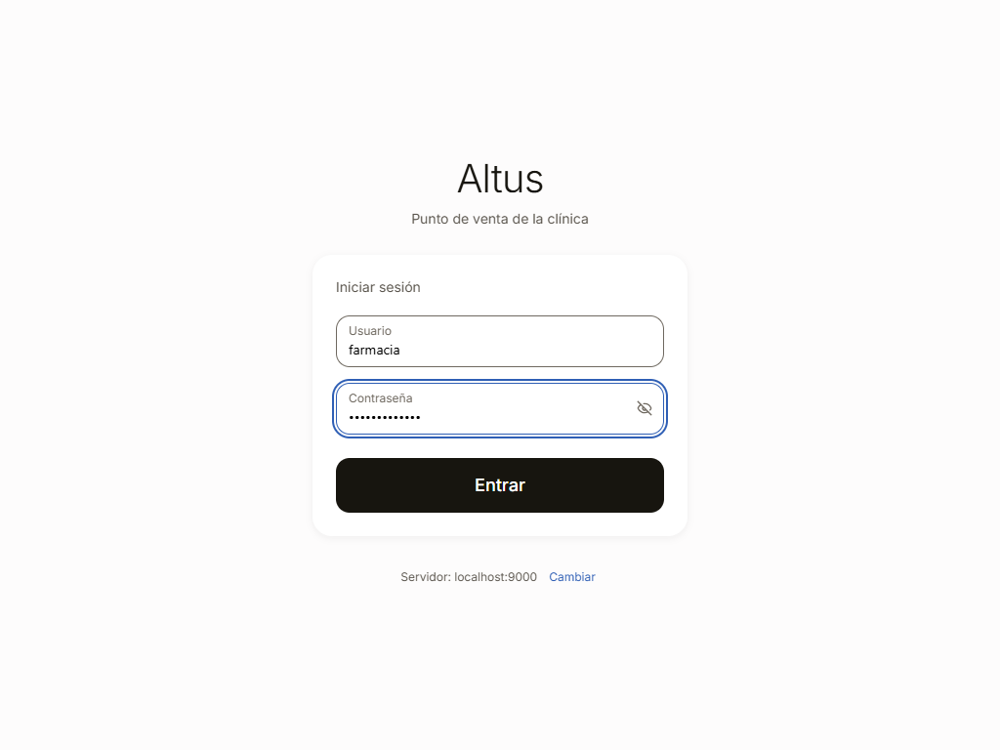

### 3.2 Existencias

Aterrizas en **Existencias**: cada presentación con sus unidades **de venta** (tabletas, cápsulas,
piezas), no cajas, en el almacén que elijas arriba. Lo que está bajo su mínimo se pinta de rojo y sube al
principio.

Toca una presentación para ver **sus lotes**, el que caduca antes primero, con su caducidad y su estante.
Abajo se ve el mínimo y el máximo que fijó Almacén; Farmacia no los cambia.

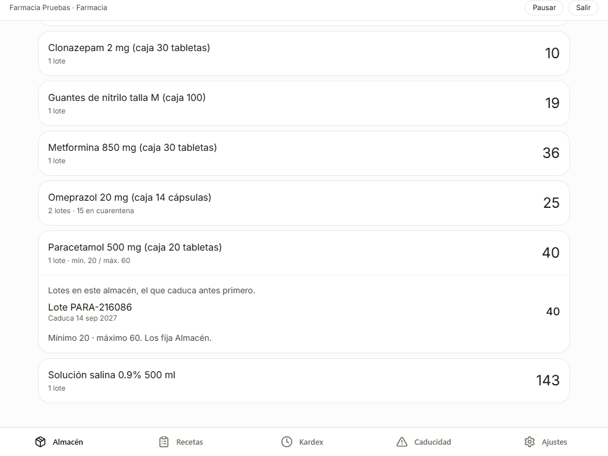

---

## 4. Recetas de mostrador

### 4.1 La lista

**Recetas** trae las recetas de mostrador pendientes, la más reciente primero: paciente, hora, quién la
emitió, cuántos renglones y cuántas unidades. Las órdenes que el médico manda a consulta no aparecen
aquí: esas las aplica Enfermería.

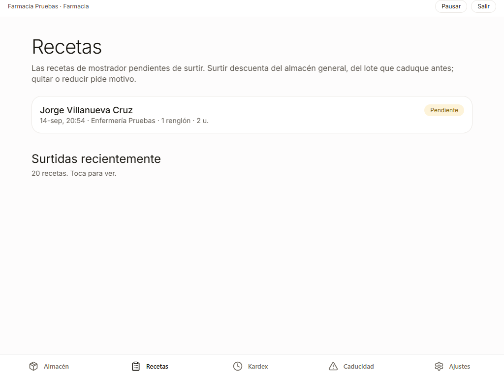

Toca una para abrirla: cada medicamento con sus **indicaciones** y las notas. **Imprimir** saca la receta
en papel para el paciente.

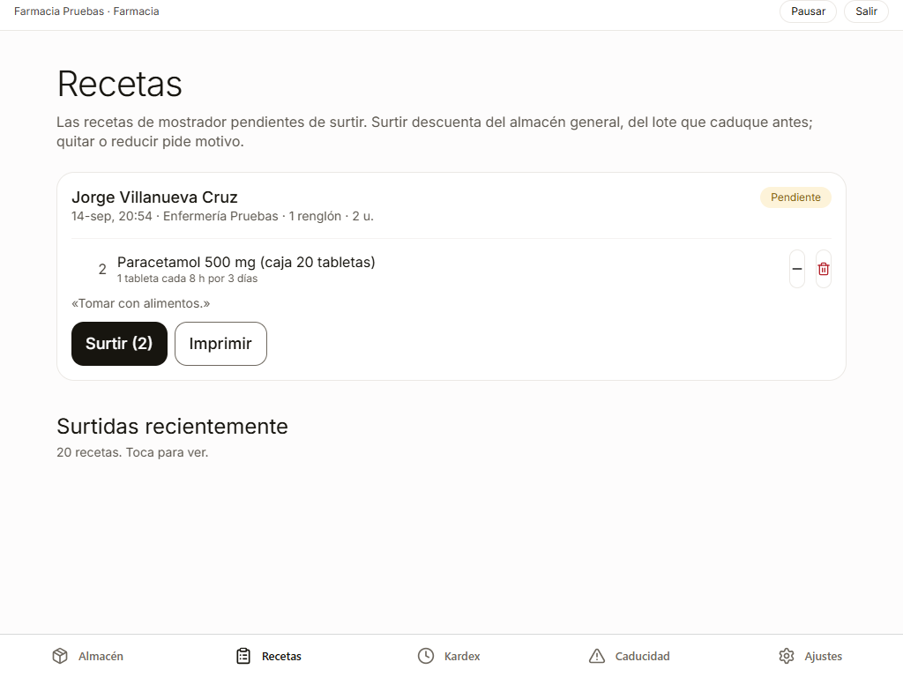

### 4.2 Quitar o reducir, con motivo

Si el paciente se lleva menos, o algo no se va a surtir, usa **−** (una menos) o el **bote** (quitar el
renglón). El sistema pide el **motivo**, de al menos **20 caracteres**: queda en el registro de la receta,
lo ve quien la emitió y lo ve Auditoría. «Ya no» no basta; hace falta una frase.

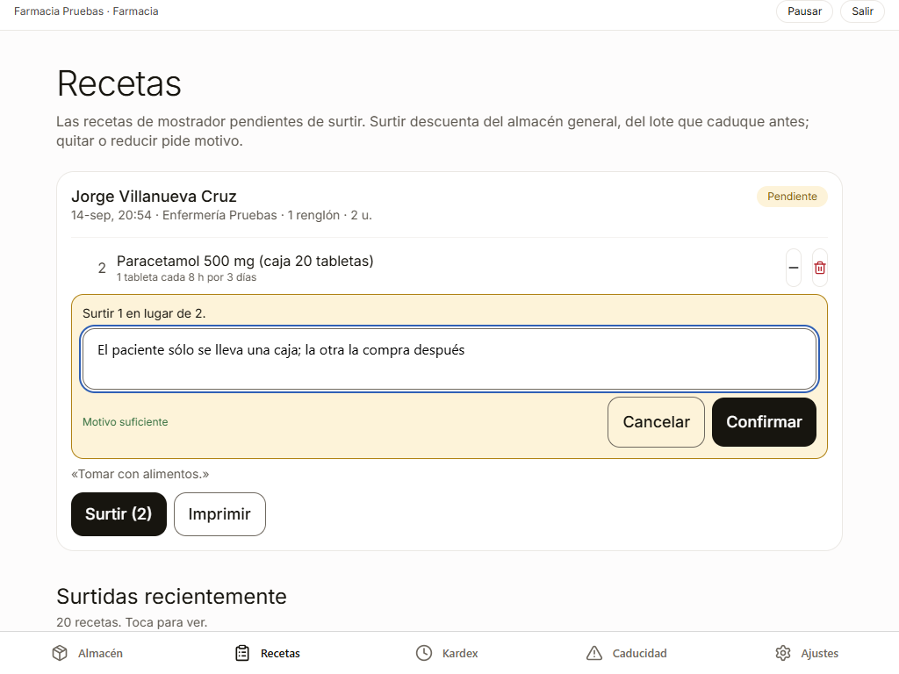

Confirmado, la receta muestra la nueva cantidad y el **ajuste** con quién lo hizo y por qué.

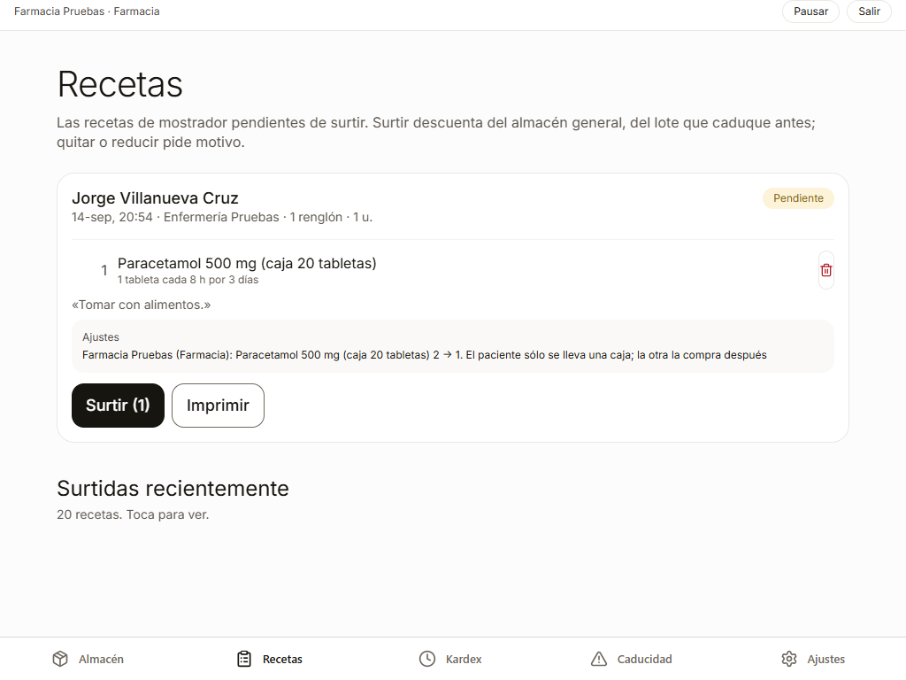

Farmacia sólo quita o reduce: no puede añadir medicamentos ni aumentar cantidades.

### 4.3 Surtir

**Surtir (n)** —n es el total de unidades— pide confirmación y dice de dónde va a salir: del almacén
general, **del lote que caduque antes**. No se puede deshacer.

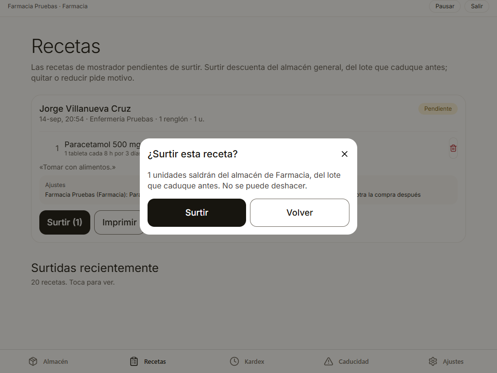

Surtida, la tarjeta cambia a verde y dice exactamente **qué salió, de qué lote y cuánto queda** de ese
lote. Desde ahí se imprime la receta; **Listo** retira la tarjeta de la lista.

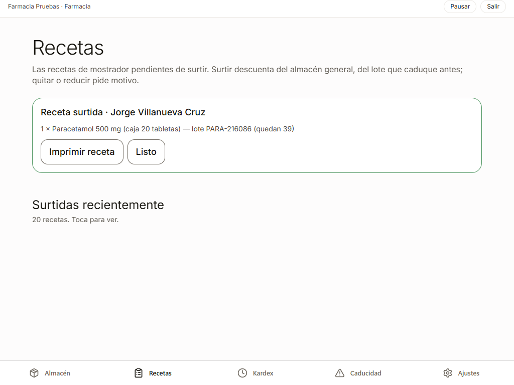

Si dos personas pulsan **Surtir** sobre la misma receta al mismo tiempo, sólo una la surte: el
inventario no se descuenta dos veces. Lo surtido no se cobra aquí; si el paciente debe pagarlo, pasa a
Caja.

---

## 5. Kardex y caducidades

**Kardex** es el libro del inventario: cada movimiento con su lote, su motivo y quién lo hizo. Filtra por
almacén, periodo y tipo.

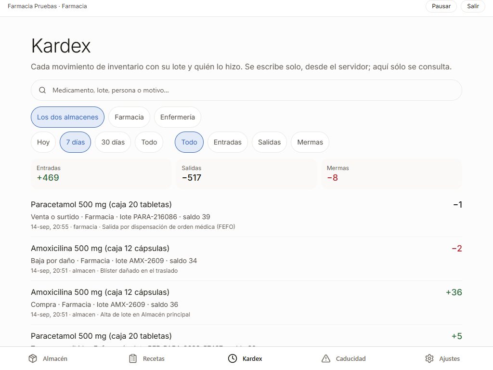

**Caducidad** muestra lo que vence en los próximos 90 días y lo que ya venció. **Descargar CSV** se lo
lleva a una hoja de cálculo.

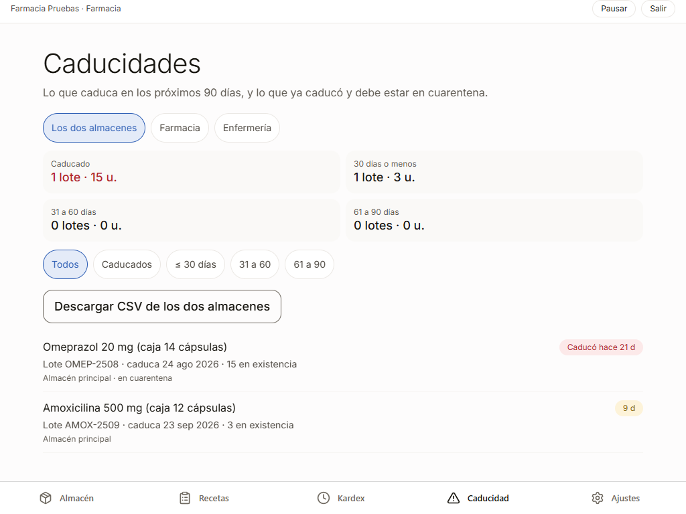

---

## 6. Ajustes y tu turno

**Mi turno**: ábrelo al empezar la jornada y ciérralo al terminar. Tus turnos y horas son la base del pago
por turno o por hora que fija RH, y lo que surtes cuenta si tu esquema tiene comisión.

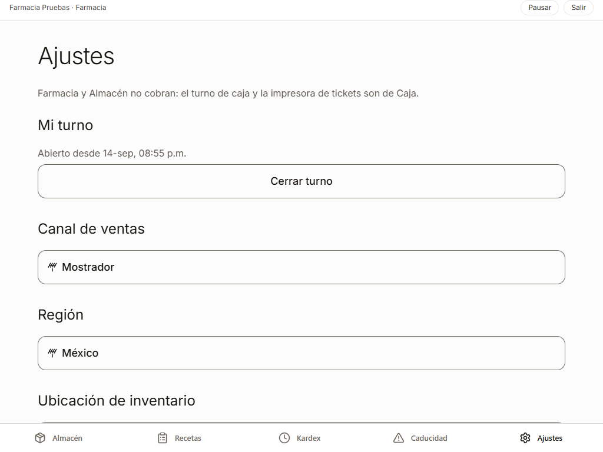

---

## 7. Lo que Farmacia no puede hacer, y cómo se ve

Si intenta entrar a una pantalla de Caja por una dirección directa, el sistema la devuelve a sus
existencias. El servidor rechaza cualquier intento de cobrar, dar de alta un lote, traspasar o leer la
bitácora, aunque se haga fuera de la aplicación.

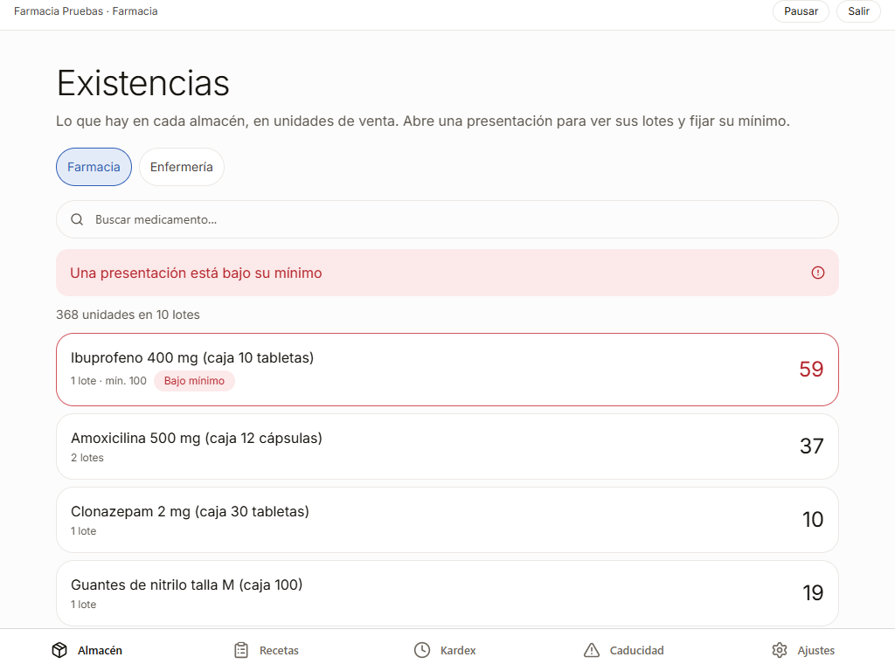

---

## 8. Pausar y salir

**Pausar** bloquea la pantalla sin cerrar nada; para volver, tu contraseña y **Continuar**. **Salir** pide
**Confirmar salida**; las recetas pendientes siguen ahí cuando vuelvas.

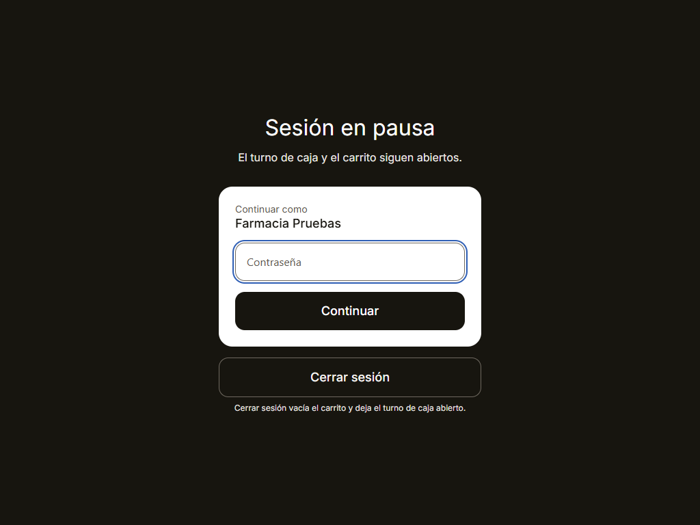

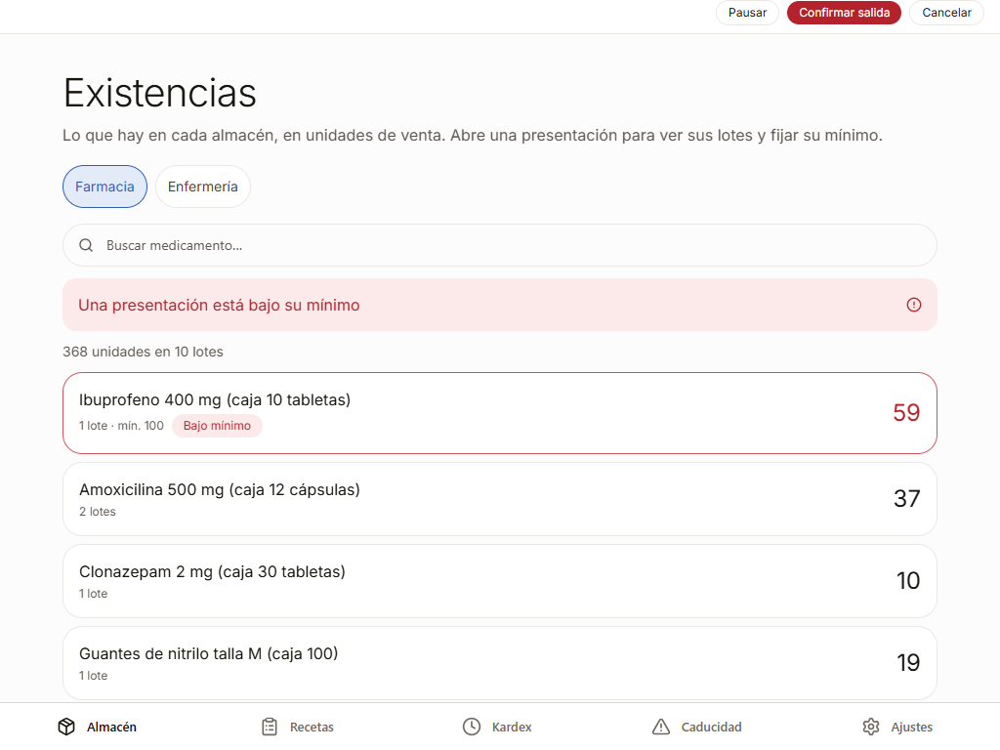

---

## 9. Si algo no sale

| Qué ves | Qué significa | Qué hacer |
|---|---|---|
| Al surtir: aviso de existencia y no pasa nada | A algún renglón no le alcanza la existencia | Reduce con motivo lo que no hay, o pide a Almacén que registre lo que llegó |
| **Confirmar** está gris al quitar o reducir | El motivo tiene menos de 20 caracteres | Escribe una frase que explique por qué |
| El médico dice que mandó una receta y no está en **Recetas** | Las del médico van a **consulta** | Las aplica Enfermería en su bandeja |
| Un lote aparece **En cuarentena** | Caducó; el sistema lo saca cada mañana | Avisa a Almacén para su destrucción |
| «Cuenta bloqueada» al entrar | Administración bloqueó tu cuenta | Habla con Administración; tu clave sigue siendo la misma |

---

*Este manual se genera a partir de un recorrido real del sistema. Las capturas se regeneran con
`npm run farmacia` dentro de `docs/manual/`; el texto se revisa a mano cuando cambia una pantalla.*
