# Manual de uso · Médico

Punto de venta Altus · tableta apaisada · versión del 14 de septiembre de 2026

Este manual describe lo que ve y lo que hace quien atiende la consulta con el perfil **Médico**.
Está escrito para quien va a usar el sistema, no para quien lo programa, y cada paso lleva la
pantalla tal como se ve en la tableta del consultorio.

Las capturas se tomaron con la cuenta de pruebas «Médico Pruebas» y pacientes de ejemplo. En la
clínica aparecerán los nombres reales.

---

## 1. Qué hace el Médico

El médico **atiende y prescribe**. Abre su turno al empezar la consulta, revisa el historial del
paciente, emite la receta —que siempre va a **Enfermería**— y deja la **nota de atención** con lo
que revisó y lo que hizo. No cobra, no surte y no toca inventario: lo que indica lo aplica
Enfermería, y lo cobra Caja.

| Puede | No puede |
|---|---|
| Abrir y cerrar **su turno** de consulta | Abrir un turno de caja ni cobrar nada |
| Ver el directorio de pacientes, con **los que tienen receta pendiente primero**, su historial de notas y sus recetas anteriores | Ver las compras del paciente ni sus tickets |
| Corregir los datos de contacto del paciente y darlo de alta si es nuevo (sin correo) | Dar de baja a un paciente |
| Ver cuánto hay de cada medicamento en **Enfermería** y en **Farmacia** al recetar | Recetar más de lo que hay entre los dos almacenes |
| Emitir recetas con **indicaciones obligatorias** por medicamento y **notas para Enfermería** | Mandar la receta a Farmacia: la receta del médico siempre va a Enfermería |
| Escribir la **nota de atención** (qué revisó, qué hizo y la fecha) e imprimirla | Leer la bitácora del sistema |
| Imprimir la receta en **media carta**, con sus datos profesionales | Cambiar su cédula o universidad: las captura Administración |
| Seguir el estado de sus recetas, ver quién ajustó qué y **cancelar** las pendientes | Cancelar una receta ya aplicada |

Su esquema de pago lo fija RH o Administración; el reporte de honorarios cuenta lo cobrado de sus
recetas. Por eso importa abrir el turno al empezar.

---

## 2. Las pantallas del Médico

Cuatro pestañas abajo y, en tableta, la **receta siempre a la vista** como columna derecha del
catálogo. Arriba, la barra de sesión: quién está trabajando, **Pausar** y **Salir**.

| Pestaña | Para qué sirve |
|---|---|
| **Pacientes** | Donde entras. Los que tienen orden pendiente, arriba. Buscar, dar de alta, abrir el **historial** y empezar la receta |
| **Productos** | Tu encabezado de receta y el catálogo con existencias. Con «+» se añade a la receta |
| **Mis recetas** | Lo que has emitido, con su estado y los ajustes que hizo Enfermería |
| **Ajustes** | **Mi turno**, y los datos del equipo |

---

## 3. La consulta, paso a paso

### 3.1 Entrar

Escribe tu **usuario** (`medico`, o el que te dieron, sin arroba) y tu contraseña, y pulsa
**Entrar**.

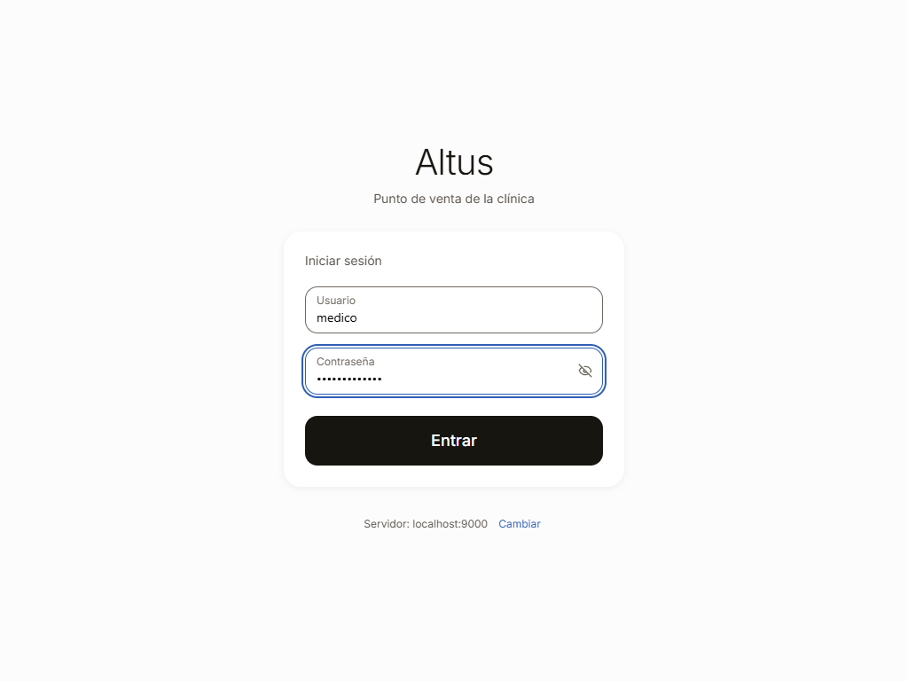

### 3.2 Tu encabezado y el catálogo

Al entrar aterrizas en **Pacientes**: quien tiene una orden pendiente aparece arriba. En todas las
pestañas, bajo el título, va una línea con **quién firma**: tu nombre, especialidad y cédulas. Si
falta la cédula o la universidad, esa línea lo dice.

En **Productos**, arriba del catálogo, está **tu encabezado de receta** completo, el mismo que sale
impreso: la clínica y su logo, tu nombre, especialidad, **cédula profesional**, universidad y
teléfono del consultorio. Son los datos que Administración capturó al darte de alta; si falta
alguno, el encabezado lo avisa y hay que pedírselo a Administración.

Cada medicamento dice cuánto hay: **Enf. 73 · Farm. 35** es lo disponible en el almacén de
Enfermería y en el de Farmacia (sin lotes caducados ni en cuarentena). La receta empieza vacía a la
derecha.

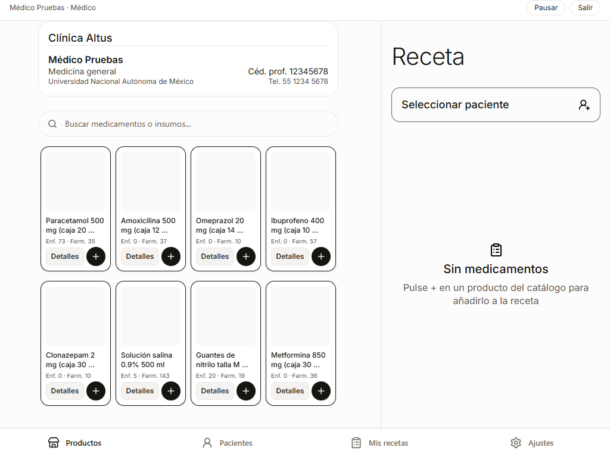

### 3.3 Abrir tu turno

Ve a **Ajustes**. La primera sección es **Mi turno**: si no hay uno abierto, lo dice y ofrece
**Abrir turno**. Hazlo al empezar la consulta.

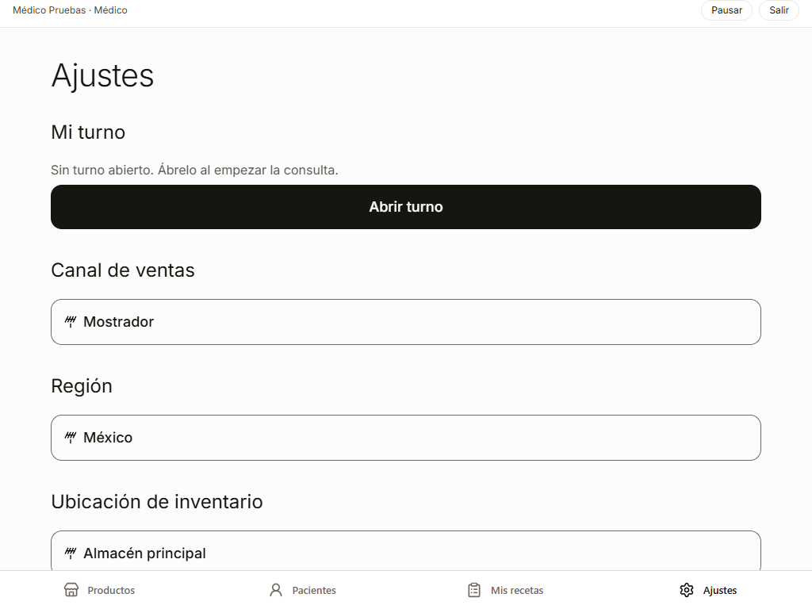

Abierto, la sección muestra desde cuándo y el botón pasa a **Cerrar turno**. El turno se cierra
al terminar la jornada, no entre pacientes.

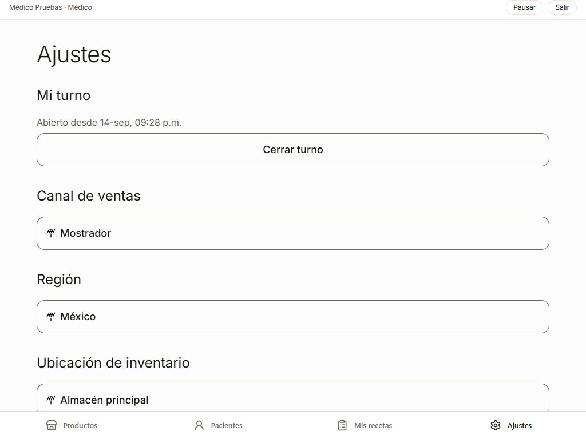

### 3.4 Buscar al paciente y revisar su historial

En **Pacientes** se busca por nombre, y cada tarjeta lleva a **Historial**. Cuando hay pacientes con
una **receta pendiente**, aparecen arriba en su propia sección, con cuántas tienen; en la captura no
había ninguna. Si el paciente no existe, **Nuevo paciente** —arriba a la derecha— lo da de alta con
nombre, apellidos y teléfono, y abre su ficha de inmediato.

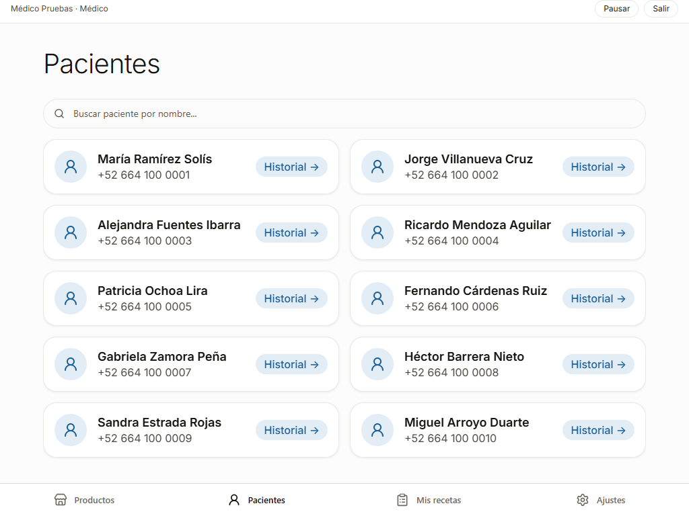

El **Perfil del Paciente** muestra sus datos de contacto, el expediente si lo tiene, las **notas de
atención** anteriores y las **recetas anteriores** con su estado.

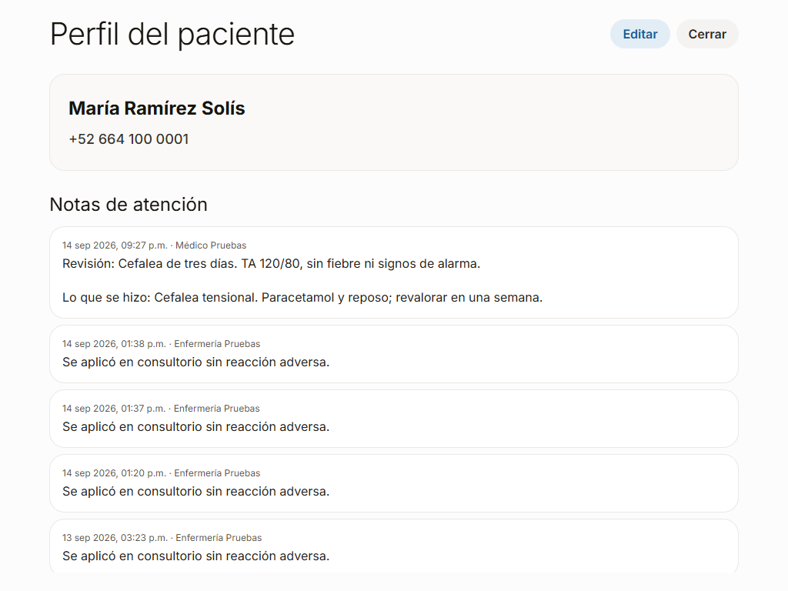

**Nueva receta** deja al paciente puesto en la receta y te lleva al catálogo a armarla: no hace
falta volver a buscarlo. **Editar** abre el formulario para corregir un teléfono o un apellido. Se
guarda con «Guardar Cambios» o se cierra con la ✕ sin tocar nada.

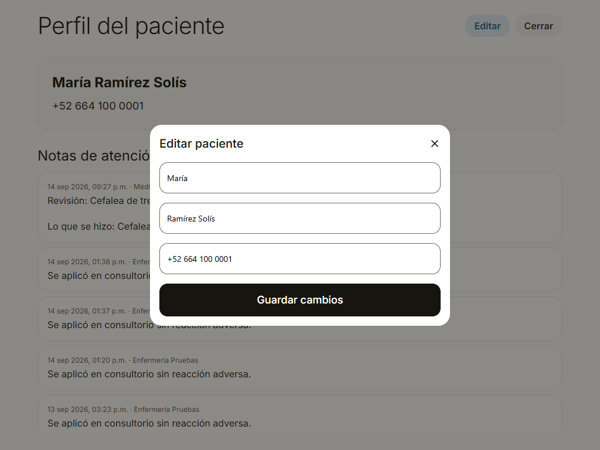

### 3.5 Buscar el medicamento y ver si hay

Vuelve a **Productos** y busca. Las existencias de cada almacén están en la tarjeta. Un producto que
no tiene existencia en ninguno de los dos dice **Sin existencia** y su «+» se apaga: no se puede
recetar lo que no hay.

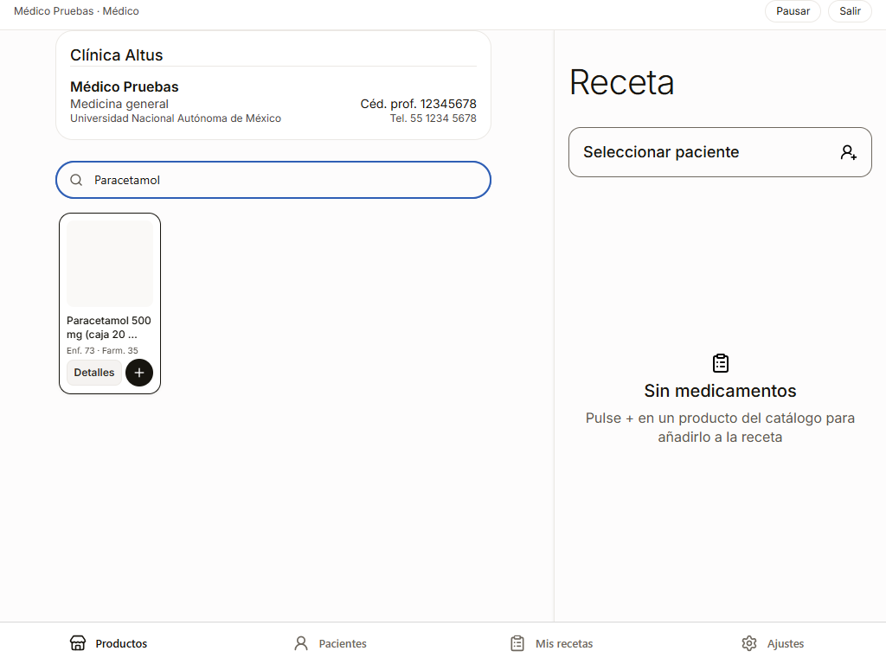

### 3.6 Armar la receta

Pulsa el **+**. El medicamento aparece en la receta con cantidad 1 y, debajo, lo que hay en cada
almacén. La cantidad se ajusta con − y +, **hasta lo que hay entre Enfermería y Farmacia**; si pides
más de lo que tiene Enfermería, la receta avisa que Enfermería tendrá que pedir a Farmacia.

El campo de **indicaciones es obligatorio**: dosis, vía, frecuencia y duración. Mientras un
medicamento no tenga indicaciones, la receta no se puede emitir.

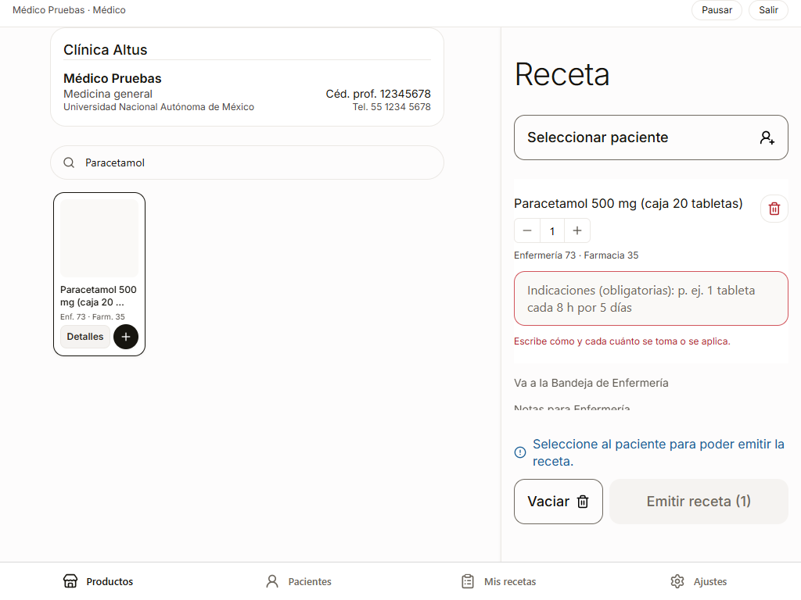

La receta dice **Va a la Bandeja de Enfermería**: no hay que elegir destino. Debajo, las **Notas para
Enfermería**: lo que Enfermería debe saber al aplicar (alergias, vía, cuidados). Estas notas **no
salen en la receta del paciente**.

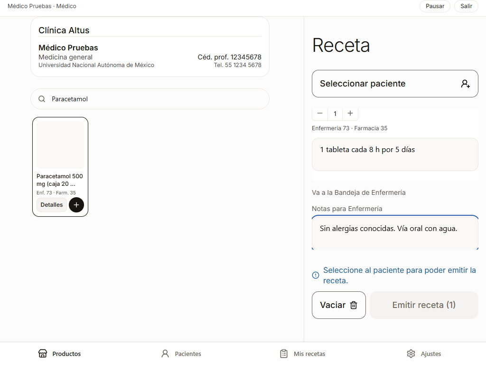

### 3.7 La nota de atención

Más abajo, en la misma receta, está la **Nota de atención**, que va al expediente:

- **Fecha de la atención**: por omisión hoy; se cambia si la consulta fue otro día (no se aceptan
  fechas futuras).
- **Qué revisó**: motivo de consulta, exploración, signos vitales, hallazgos.
- **Qué hizo**: diagnóstico, procedimiento, tratamiento, recomendaciones.

Las dos partes son obligatorias. **Enfermería no ve esta nota**: le llega sólo la receta con sus
notas para Enfermería. La leen el médico, Administración y Auditoría.

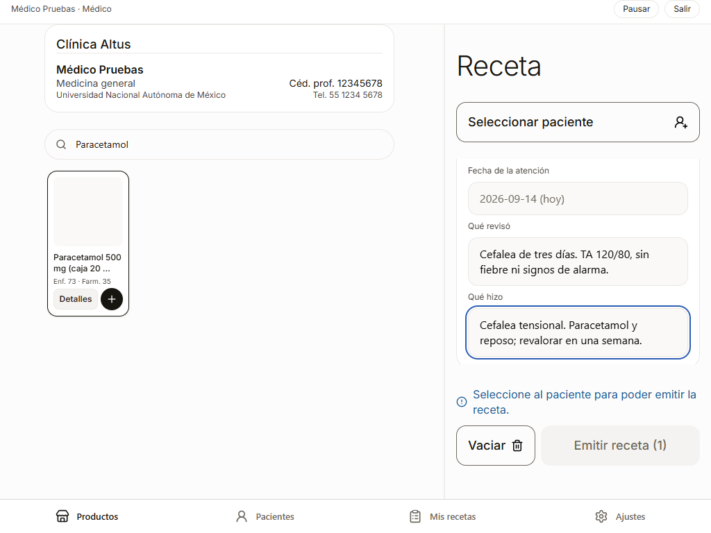

### 3.8 El paciente y emitir

Pulsa **Seleccionar paciente**. Se busca por nombre; si no existe, **Nuevo paciente** lo da de alta
ahí mismo. Toca su nombre y confirma con **Asignar a …**.

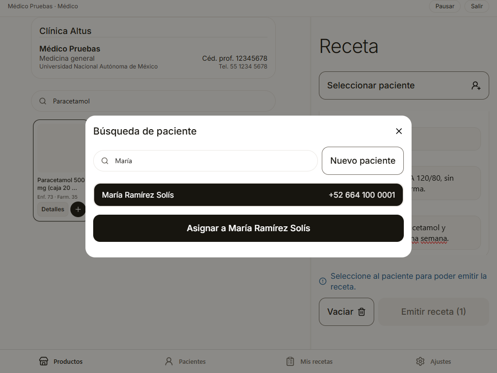

Con paciente, medicamentos con indicaciones y la nota completa, **Ver y emitir (1)** se enciende. El
número es cuántas unidades lleva.

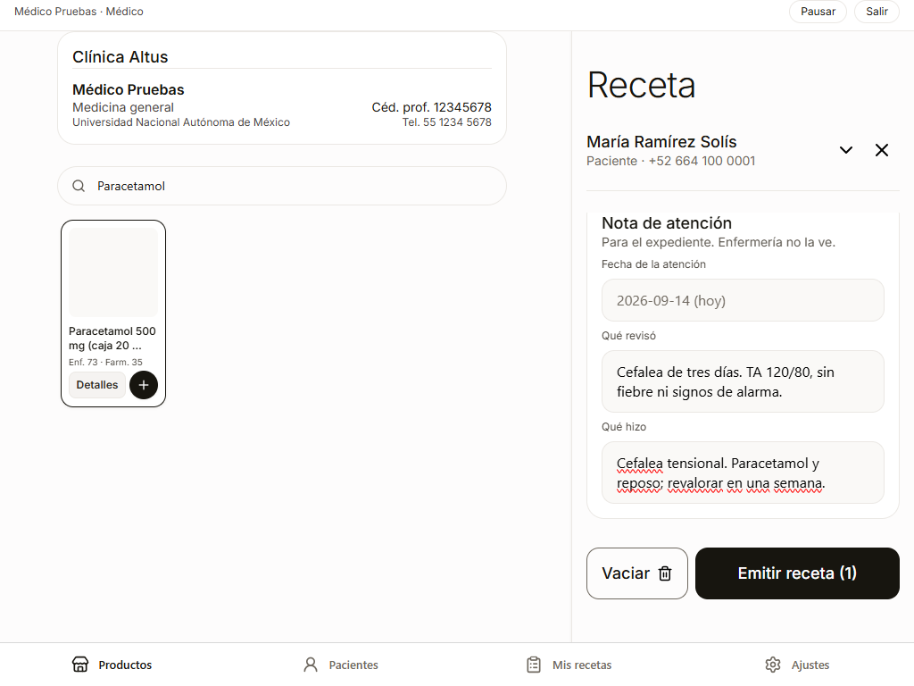

Al pulsarlo aparece la **vista previa**: la receta tal como va a salir, con tu encabezado y cédula,
el paciente, la fecha y cada medicamento con su indicación. Revísala; si algo está mal, **Corregir**
vuelve sin perder nada. **Enviar a Enfermería** la manda a su Bandeja; el consumo pasará a la cuenta
del paciente para que Caja lo cobre.

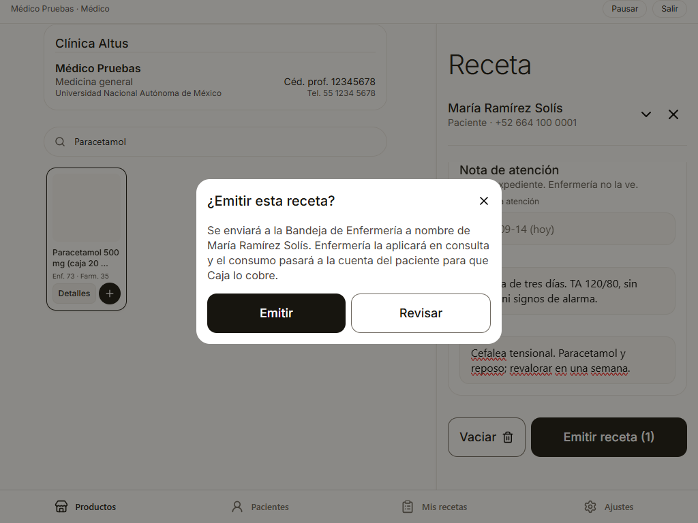

### 3.9 Orden enviada, receta impresa

Emitida, la columna muestra el **folio**, el paciente y cuántos medicamentos, con **Imprimir
receta** y **Nueva receta**. Debajo, **Nota de atención guardada**, con su botón **Imprimir nota**.

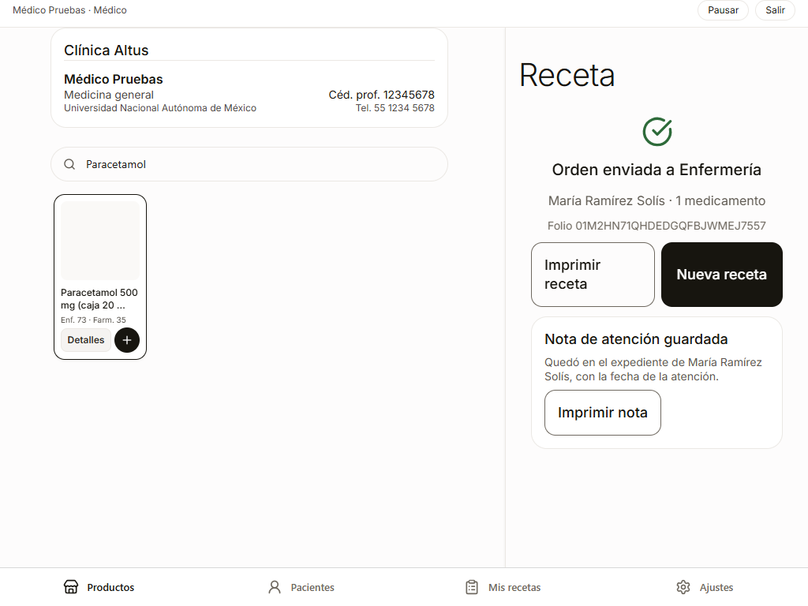

La receta sale en **media carta** (5.5 × 8.5 pulgadas): la clínica y los logos, tus datos
profesionales, el paciente y la fecha, cada medicamento con su cantidad e indicaciones, y la firma con
tu nombre y cédula. No lleva las notas para Enfermería ni la nota de atención.

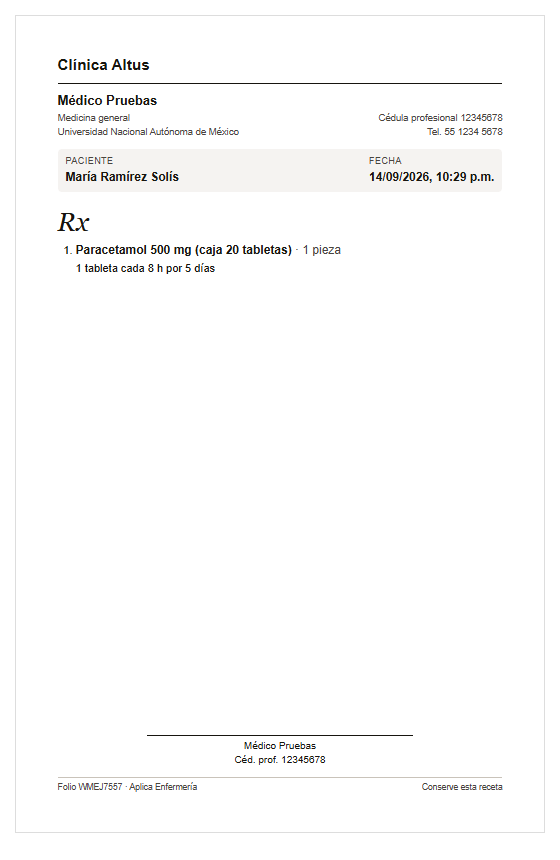

### 3.10 Seguir tus recetas

**Mis recetas** lista lo que has emitido, la más reciente primero, con su estado: **Pendiente en
Enfermería**, **Aplicada en consulta** o **Cancelada**.

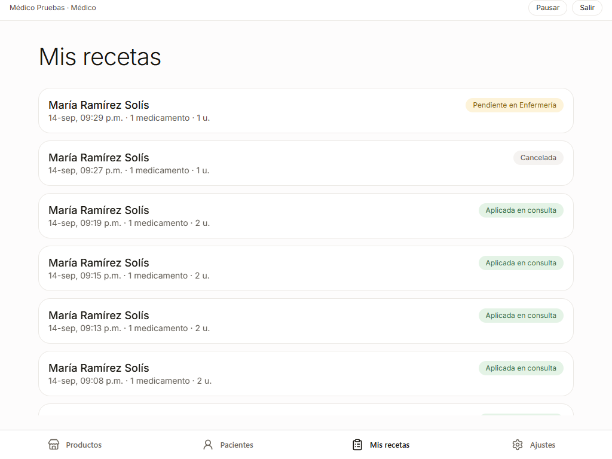

Al tocar una se despliegan sus renglones y el folio. Si Enfermería **quitó o redujo** algún
medicamento, aparece el ajuste con quién lo hizo y su motivo. Una receta **pendiente** se puede
**cancelar**; una ya aplicada, no.

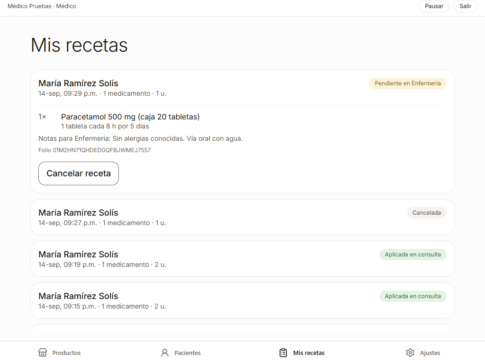

---

## 4. Lo que el Médico no puede hacer, y cómo se ve

Si el médico intenta entrar a una pantalla de Caja o de almacén por una dirección directa, el
sistema lo devuelve a su catálogo. El servidor rechaza cualquier intento de cobrar, mover
inventario, mandar una receta a Farmacia o consultar la bitácora, aunque se haga fuera de la
aplicación.

---

## 5. Cerrar el turno, pausar y salir

Al terminar la jornada, **Ajustes → Cerrar turno**.

**Pausar** bloquea la pantalla sin cerrar nada; para volver, tu contraseña y **Continuar**. **Salir**
pide **Confirmar salida** y vacía la receta que tuvieras a medias.

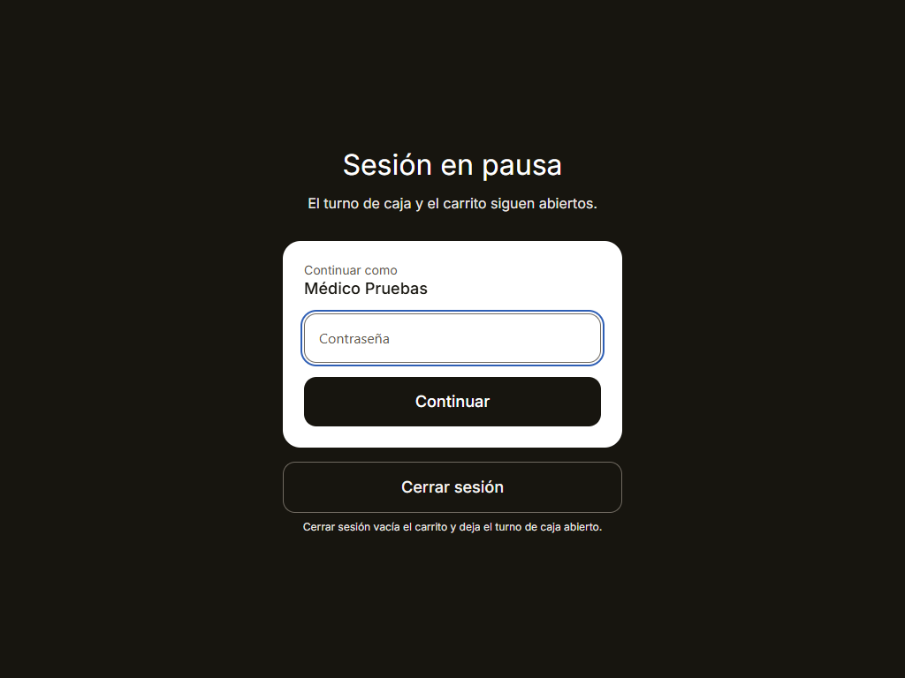

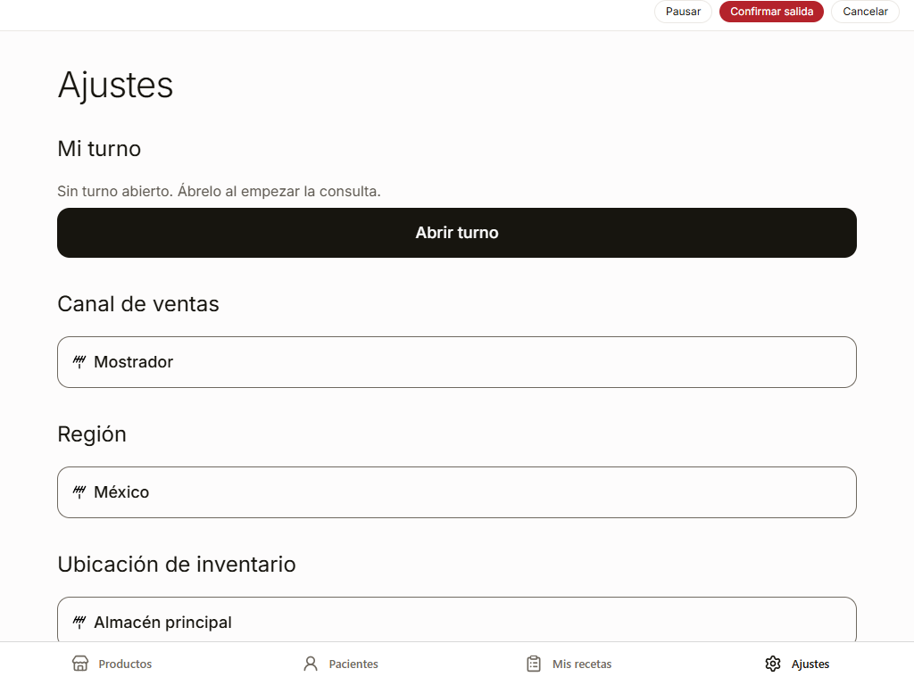

---

## 6. Si algo no sale

| Qué ves | Qué significa | Qué hacer |
|---|---|---|
| «Emitir receta» apagado y aviso azul | Falta el paciente, unas indicaciones o la nota de atención | Lee el aviso: dice qué falta |
| «Sin existencia» en un producto | No hay en Enfermería ni en Farmacia | Receta otro, o avisa a Almacén para que surta |
| El + de la cantidad no sube | Llegaste a lo que hay entre los dos almacenes | Receta lo disponible o un sustituto |
| El encabezado dice que faltan datos | Administración no capturó tu cédula o universidad | Pídeselo a Administración |
| No encuentras al paciente | No está dado de alta | «Nuevo paciente», en Pacientes o en la misma búsqueda de la receta |
| Viste un error en la vista previa | Todavía no se ha enviado nada | **Corregir**, arregla el renglón y vuelve a **Ver y emitir** |
| «Pendiente en Enfermería» lleva mucho | Enfermería aún no la aplicó | Avisa a Enfermería; si ya no procede, cancélala |
| Olvidaste abrir el turno | Tus horas no cuentan para la nómina | Ábrelo en cuanto lo notes |

---

*Este manual se genera a partir de un recorrido real del sistema. Las capturas se regeneran con
`npm run medico` dentro de `docs/manual/`; el texto se revisa a mano cuando cambia una pantalla.*
