# Manual de uso · RH y contabilidad

Punto de venta Altus · tableta apaisada · versión del 14 de septiembre de 2026

Este manual describe lo que ve y lo que hace quien lleva la nómina, las comisiones y el control del
personal con el perfil **RH y contabilidad**. Está escrito para quien va a usar el sistema, no para quien
lo programa, y cada paso lleva la pantalla tal como se ve en la tableta.

Las capturas se tomaron con la cuenta de pruebas «RH Pruebas». En la clínica aparecerán los nombres
reales.

---

## 1. Qué hace RH y contabilidad

RH responde tres preguntas: **quién trabajó y qué hizo**, **cuánto le toca a cada quien** y **qué ya se
pagó**. Para eso tiene la actividad del personal por día, los cortes de caja, los honorarios con su
desglose y el registro de pagos con recibo.

RH **no ve contenido clínico**: ni recetas, ni notas de atención, ni expedientes. Tampoco mueve
inventario ni cobra.

| Puede | No puede |
|---|---|
| Sacar la **actividad del personal** por día o por persona, para Excel o impresa | Leer recetas, notas de atención o expedientes |
| Sacar **honorarios y nómina**, **cortes de caja** y **ventas** | Ver la bitácora completa del sistema |
| Ver la **nómina del periodo** de cada persona con su desglose | Cambiar precios, inventario o cobrar |
| **Registrar pagos** con referencia; sale el recibo | Pagar dos veces el mismo periodo a la misma persona |
| Definir el **esquema de pago** de cada persona (en el panel, con Administración) | Dar de alta o de baja personal: eso es de Administración |
| Registrar **su turno** | — |

---

## 2. Las pantallas de RH

Cuatro pestañas abajo. Arriba, la barra de sesión: quién está trabajando, **Pausar** y **Salir**.

| Pestaña | Para qué sirve |
|---|---|
| **Reportes** | Actividad del personal, honorarios y nómina, cortes y ventas. **Es la pantalla de entrada** |
| **Nómina** | Lo que toca pagar a cada persona en el periodo, y el registro del pago |
| **Cortes** | Cada turno de caja cerrado, con lo esperado y lo contado |
| **Ajustes** | Tu turno, los datos del equipo y cerrar sesión |

---

## 3. Entrar

Escribe tu **usuario** (`rrhh`, o el que te dieron, sin arroba) y tu contraseña, y pulsa **Entrar**.

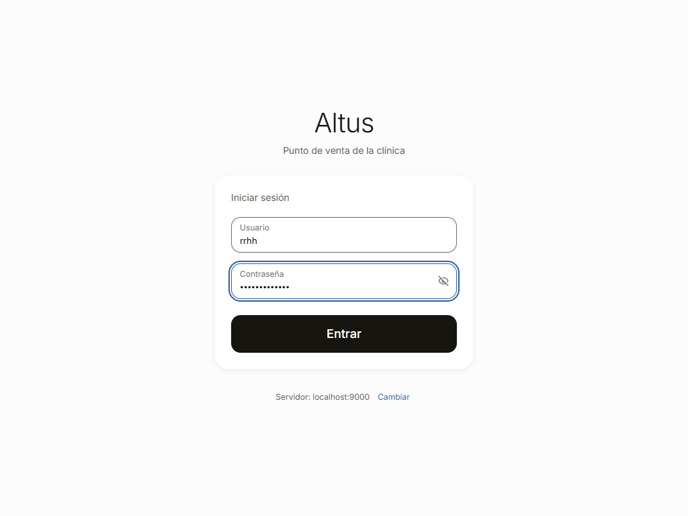

---

## 4. Reportes

### 4.1 Elegir el reporte

Aterrizas en **Reportes**. Arriba, los que tu perfil puede sacar; debajo, los filtros del que elijas
(periodo, agrupación, perfil, persona) y la **muestra**: los primeros renglones de lo que saldrá. Nada se
descarga a ciegas.

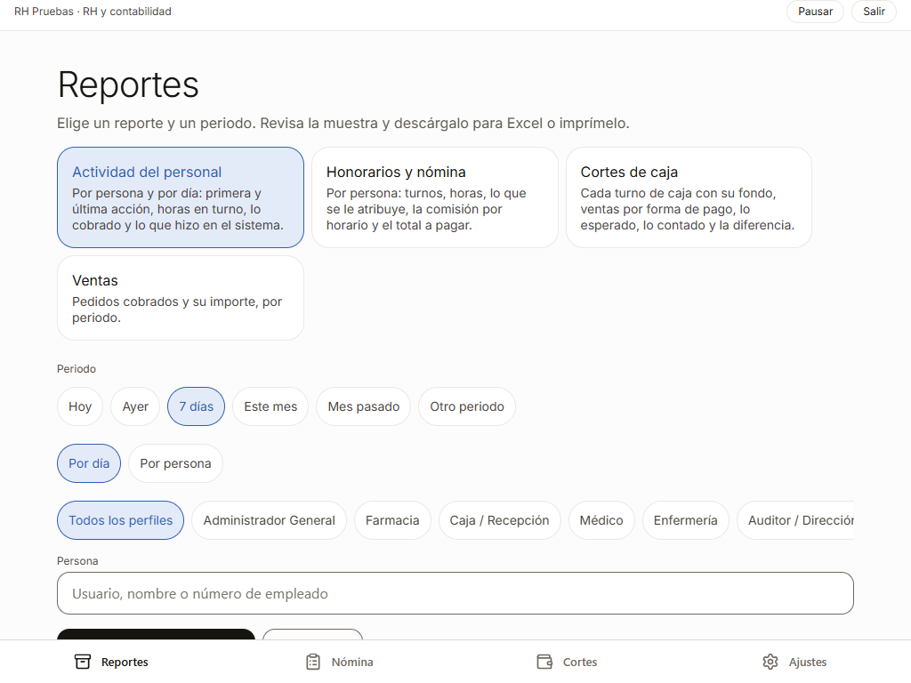

### 4.2 Actividad del personal

Por cada persona y cada día: **primera y última acción** registrada, cuántos **turnos** y cuántas **horas
en turno**, lo **cobrado en caja**, y cuántas acciones hizo de cada tipo (ventas, recetas, órdenes
aplicadas, surtidos, requisiciones, bajas, pacientes).

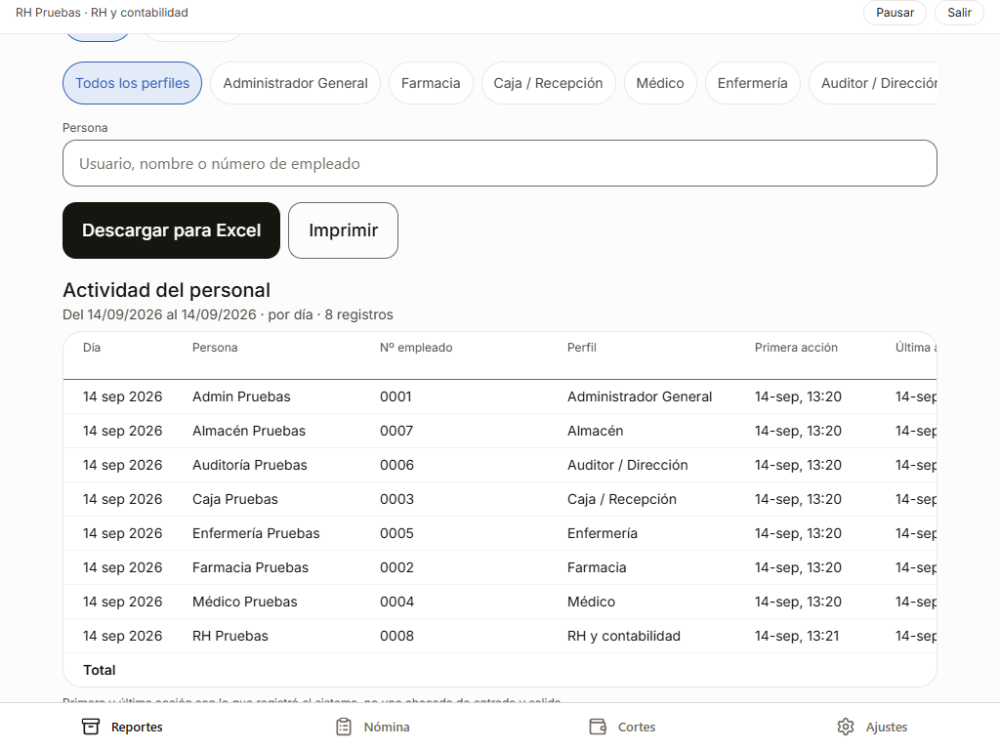

**Por persona** suma el periodo entero en un renglón por persona, con cuántos días trabajó. Es la vista
para la nómina.

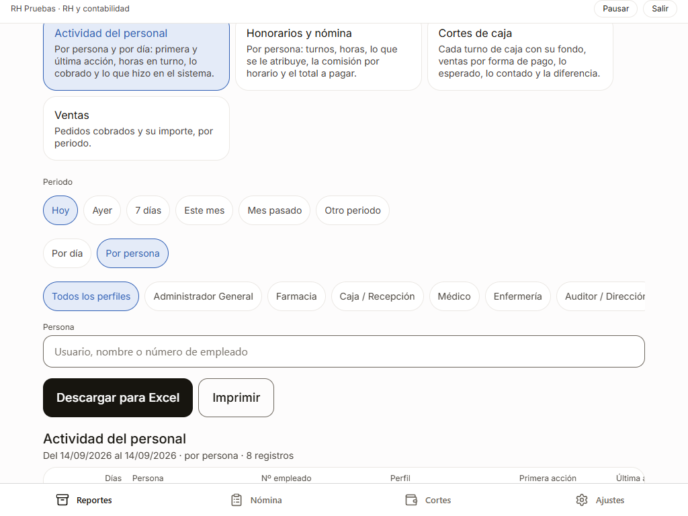

La primera y la última acción son **lo que registró el sistema**, no una checada de entrada y salida:
quien trabaja sin tocar la tableta no aparece hasta que la usa. Las horas que cuentan para el pago son
las de **turno**: el de caja y el que cada persona abre en sus Ajustes.

### 4.3 Honorarios y nómina

Por persona: turnos, horas, pago fijo, pago por hora, la **base comisionable** (lo que se le atribuye),
la **comisión por horario** y el total, con su estado **Pagado** o **Pendiente**.

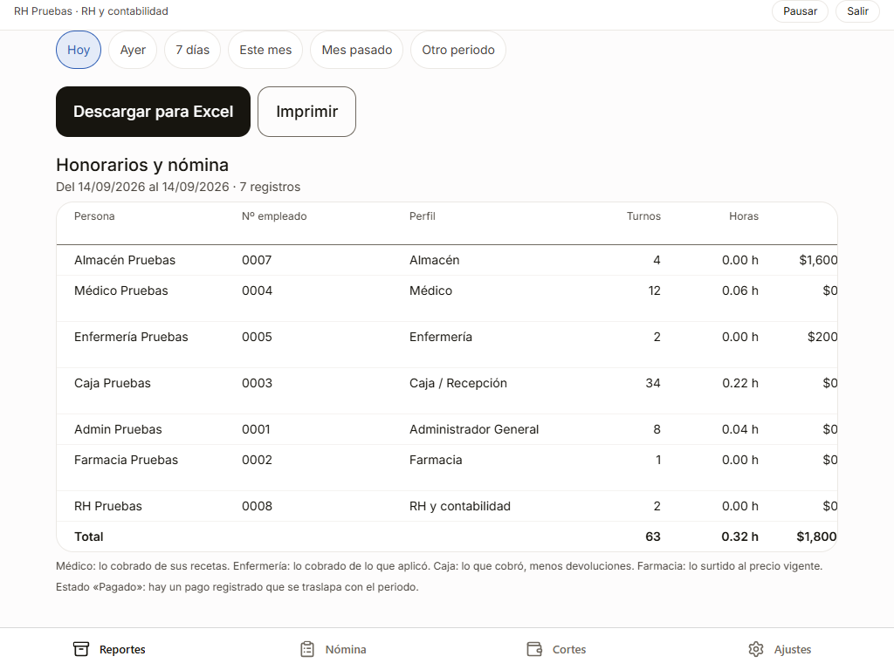

Lo que se le atribuye a cada perfil:

| Perfil | Base de su comisión |
|---|---|
| Médico | Lo cobrado de sus recetas aplicadas en consulta |
| Enfermería | Lo cobrado de lo que aplicó |
| Caja | Lo que cobró en sus turnos, menos devoluciones |
| Farmacia | Lo que surtió en mostrador, al precio de venta vigente |
| Almacén, RH, Administración | Sin comisión: pago fijo por turno o por hora |

**Descargar para Excel** baja el archivo con acentos correctos; **Imprimir** saca la hoja carta horizontal
con el membrete, quién la generó y cuándo. Cada exportación queda en la bitácora.

---

## 5. Nómina

### 5.1 El periodo

**Nómina** abre la **quincena en curso**; cambia las fechas para otro periodo. Cada persona con su total y
cómo se compone: pago fijo por turno, por hora, y la comisión de cada regla de horario (por ejemplo, 20 %
de lo cobrado de día y 30 % de noche).

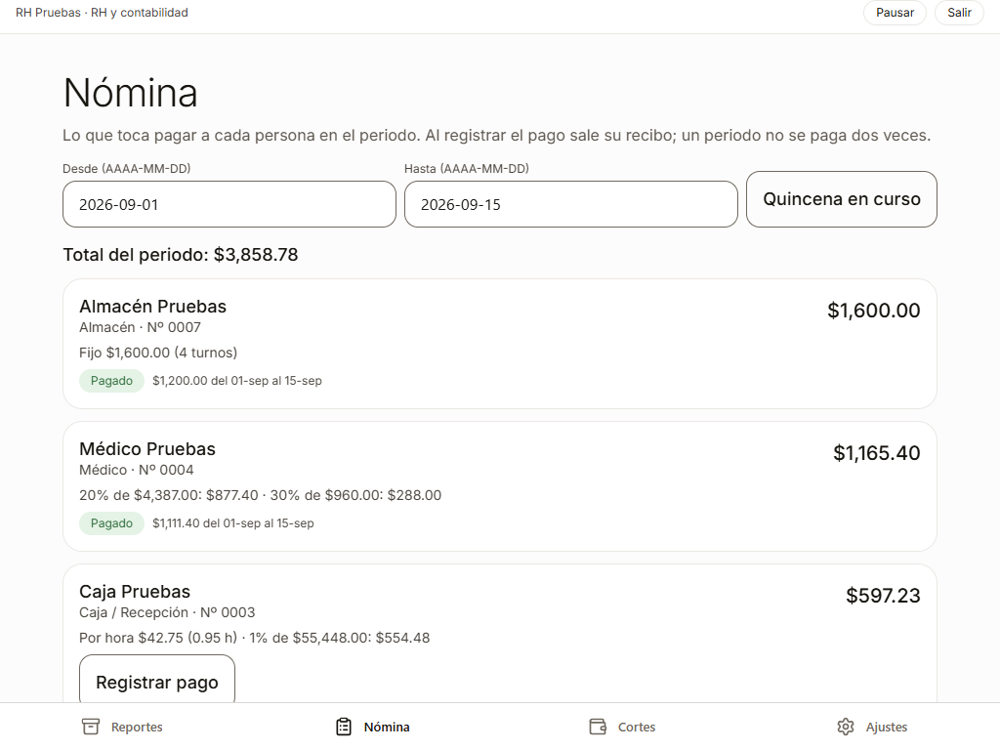

Quien dice **Sin esquema de pago** tiene actividad pero nadie ha definido cómo se le paga: se define en el
panel, en **Honorarios y nómina → Esquemas de pago**.

### 5.2 Registrar un pago

**Registrar pago** pide una referencia opcional (transferencia, cheque) y el botón dice el monto. El monto
**no se escribe**: lo recalcula el servidor en ese momento y lo guarda con su desglose, congelado. Si
después cambia el esquema de la persona, el pago sigue diciendo lo que se pagó y por qué.

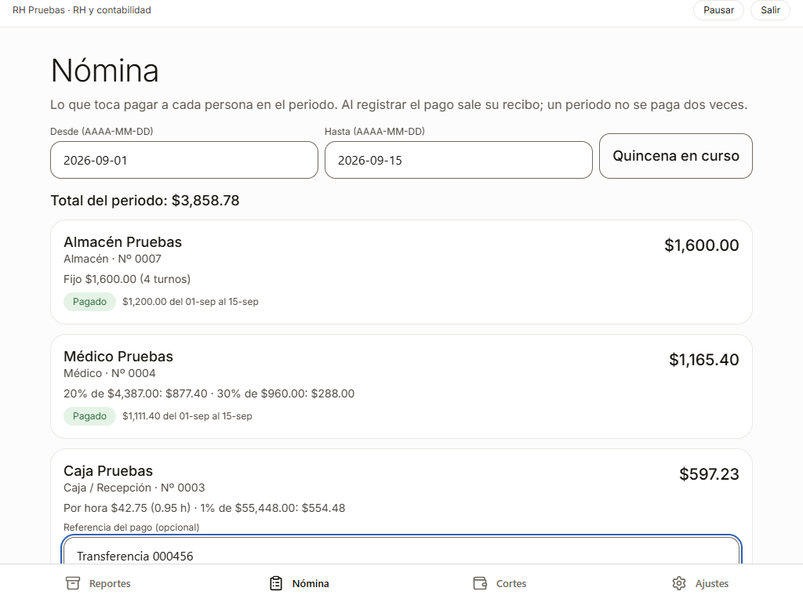

Registrado, sale el **recibo** por la impresora (con el desglose y la línea de firma «Recibí conforme») y
la tarjeta queda **Pagado** con el monto y el periodo.

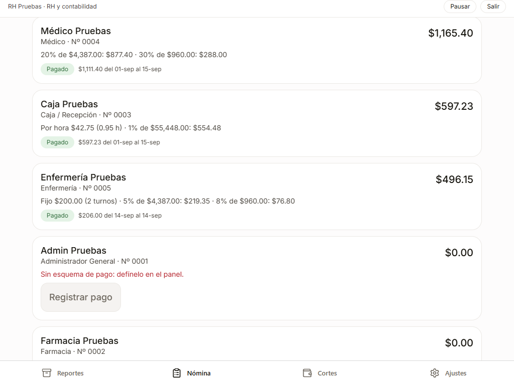

Un periodo que se **traslapa** con uno ya pagado a la misma persona no se puede volver a pagar: por eso,
si se paga por quincena, conviene no pagar días sueltos dentro de ella.

---

## 6. Cortes de caja

**Cortes** muestra cada turno de caja cerrado: quién, cuándo, fondo, lo esperado y lo contado, y si cuadró
o hubo faltante. **Imprimir corte** saca el arqueo.

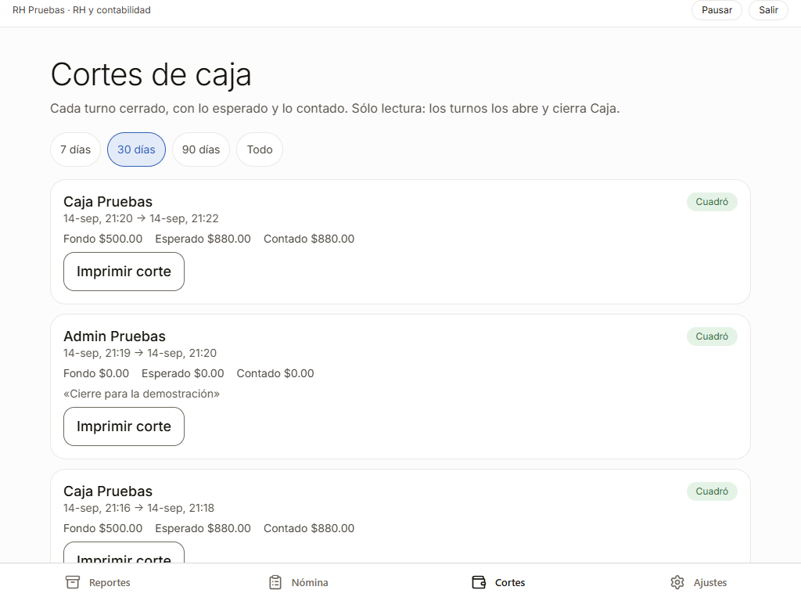

---

## 7. Ajustes y tu turno

**Mi turno**: ábrelo al empezar y ciérralo al terminar; tus horas cuentan igual que las de todos.

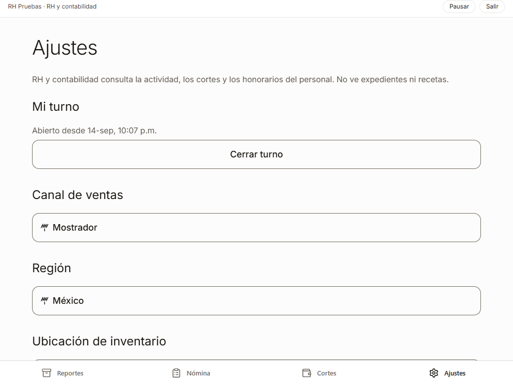

---

## 8. Lo que RH no puede hacer, y cómo se ve

Si intenta abrir la bitácora u otra pantalla ajena por una dirección directa, el sistema la devuelve a
sus reportes. El servidor rechaza cualquier intento de leer recetas, notas o expedientes, aunque se haga
fuera de la aplicación.

---

## 9. Pausar y salir

**Pausar** bloquea la pantalla sin cerrar nada; para volver, tu contraseña y **Continuar**. **Salir** pide
**Confirmar salida**.

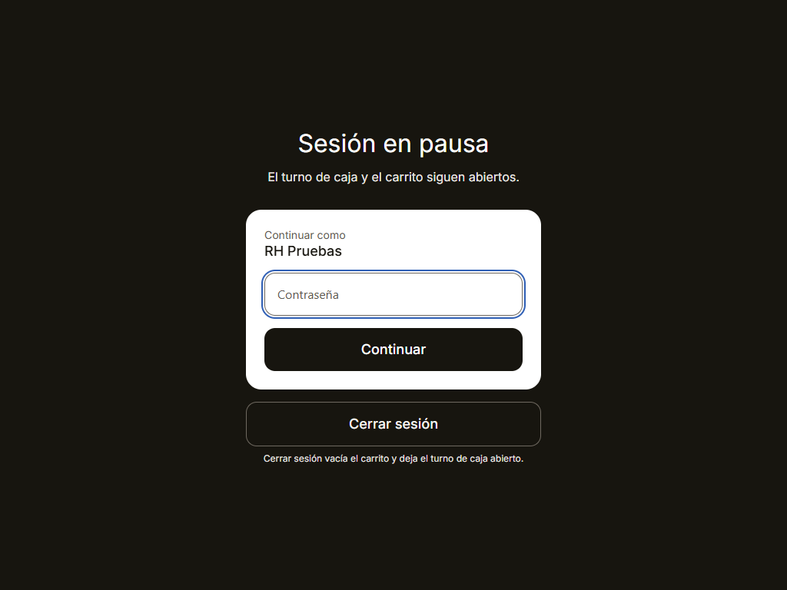

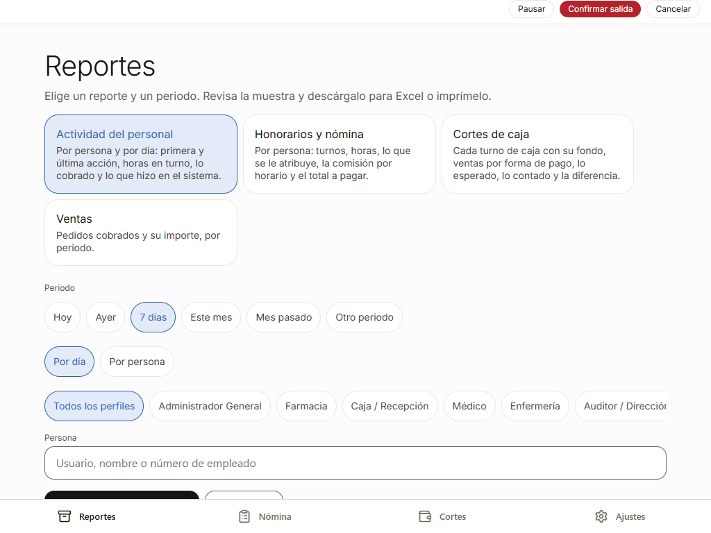

---

## 10. Si algo no sale

| Qué ves | Qué significa | Qué hacer |
|---|---|---|
| Alguien no aparece en la nómina | No tiene esquema, ni turnos, ni nada atribuido en el periodo | Revisa que haya abierto su turno; define su esquema en el panel |
| «Ese periodo ya se pagó» | Hay un pago que se traslapa con el periodo | Revisa la pestaña de pagos en el panel; paga sólo los días que faltan |
| Una persona tiene horas de más | Dejó su turno abierto | Pídele que lo cierre; un turno abierto cuenta hasta el momento de la consulta |
| La comisión del médico parece baja | Sólo cuenta lo que Caja **ya cobró** de sus recetas | Revisa en Caja las cuentas de pacientes pendientes |
| «No hay nada que pagar» | Su total del periodo es cero | Revisa su esquema o su actividad |

---

*Este manual se genera a partir de un recorrido real del sistema. Las capturas se regeneran con
`npm run rh` dentro de `docs/manual/`; el texto se revisa a mano cuando cambia una pantalla.*
